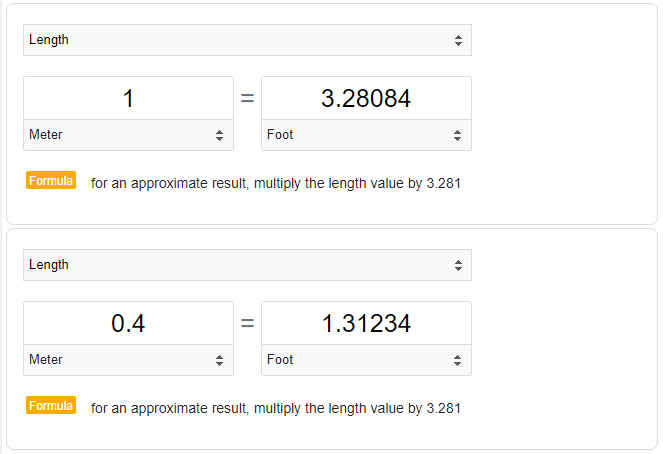

# Домашнее задание к занятию "7.5. Основы golang"

С `golang` в рамках курса, мы будем работать не много, поэтому можно использовать любой IDE. 
Но рекомендуем ознакомиться с [GoLand](https://www.jetbrains.com/ru-ru/go/).  

## Задача 1. Установите golang.
1. Воспользуйтесь инструкций с официального сайта: [https://golang.org/](https://golang.org/).
2. Так же для тестирования кода можно использовать песочницу: [https://play.golang.org/](https://play.golang.org/).  

=====  
Ответ:  
```bash
[gnoy@manjarokde-ws01 ~]$ go version
go version go1.18 linux/amd64
```

## Задача 2. Знакомство с gotour.
У Golang есть обучающая интерактивная консоль [https://tour.golang.org/](https://tour.golang.org/). 
Рекомендуется изучить максимальное количество примеров. В консоли уже написан необходимый код, 
осталось только с ним ознакомиться и поэкспериментировать как написано в инструкции в левой части экрана.    

=====  
Ответ:  
Знакомство произвел. Потыкался...
Но как-то больше понравился ресурс http://golang-book.ru/ :)

## Задача 3. Написание кода. 
Цель этого задания закрепить знания о базовом синтаксисе языка. Можно использовать редактор кода 
на своем компьютере, либо использовать песочницу: [https://play.golang.org/](https://play.golang.org/).

1. Напишите программу для перевода метров в футы (1 фут = 0.3048 метр). Можно запросить исходные данные 
у пользователя, а можно статически задать в коде.
    Для взаимодействия с пользователем можно использовать функцию `Scanf`:
    ```
    package main
    
    import "fmt"
    
    func main() {
        fmt.Print("Enter a number: ")
        var input float64
        fmt.Scanf("%f", &input)
    
        output := input * 2
    
        fmt.Println(output)    
    }
    ```

=====  
Ответ:  
[main.go](./src/task2.1/main.go)

<details>
  <summary>Тесты</summary>

```bash
[gnoy@manjarokde-ws01 task2.1]$ go run main.go 
Введите количество метров: 6
6 метр(-а) - это 19.68504 футов
[gnoy@manjarokde-ws01 task2.1]$ go run main.go 
Введите количество метров: 0.4
0.4 метр(-а) - это 1.3123360000000002 футов
```
Проверяю в googl'е:
<p align="left">
  
</p> 
</details>
 
2. Напишите программу, которая найдет наименьший элемент в любом заданном списке, например:
    ```
    x := []int{48,96,86,68,57,82,63,70,37,34,83,27,19,97,9,17,}
    ```

=====  
Ответ:  
У нас есть один заданный список (х), попробую написать программу, которая будет запрашивать у пользователя массив и искать в нем наименьший элемент.  
[main.go](./src/task2.2/main.go)

<details>
  <summary>Тесты</summary>

Ищу минимальный элемент в заданном массиве х:
```bash
[gnoy@manjarokde-ws01 task2.2]$ go run main.go 
Программа вычисляет наименьшее число из массива.
Массив по умолчанию: [48 96 86 68 57 82 63 72 37 34 83 27 19 97 9 17]
✔ Нет
Минимальный элемент в дефолтном массиве: 9
```
Теперь введу сам произвольный массив:
```bash
[gnoy@manjarokde-ws01 task2.2]$ go run main.go 
Программа вычисляет наименьшее число из массива.
Массив по умолчанию: [48 96 86 68 57 82 63 72 37 34 83 27 19 97 9 17]
✔ Да
Введите размер массива: 
7
Введите  1  число массива: 
46
Введите  2  число массива: 
24
Введите  3  число массива: 
12
Введите  4  число массива: 
98
Введите  5  число массива: 
5
Введите  6  число массива: 
3
Введите  7  число массива: 
87
Введенный массив:  [46 24 12 98 5 3 87]
Минимальный элемент в массиве: 3
[gnoy@manjarokde-ws01 task2.2]$ go run main.go 
Программа вычисляет наименьшее число из массива.
Массив по умолчанию: [48 96 86 68 57 82 63 72 37 34 83 27 19 97 9 17]
✔ Да
Введите размер массива: 
7
Введите  1  число массива: 
56
Введите  2  число массива: 
12
Введите  3  число массива: 
0
Введите  4  число массива: 
5
Введите  5  число массива: 
7
Введите  6  число массива: 
-6
Введите  7  число массива: 
-23
Введенный массив:  [56 12 0 5 7 -6 -23]
Минимальный элемент в массиве: -23
```
</details>

3. Напишите программу, которая выводит числа от 1 до 100, которые делятся на 3. То есть `(3, 6, 9, …)`.  


=====  
Ответ:  
[main.go](./src/task2.3/main.go)

<details>
  <summary>Тесты</summary>

```bash
[gnoy@manjarokde-ws01 task2.3]$ go run main.go 
Числа от 1 до 100, которые делятся на 3 без остатка: 
[3 6 9 12 15 18 21 24 27 30 33 36 39 42 45 48 51 54 57 60 63 66 69 72 75 78 81 84 87 90 93 96 99]
```
</details>
В виде решения ссылку на код или сам код.   

## Задача 4. Протестировать код (не обязательно).

Создайте тесты для функций из предыдущего задания.   

=====  
Ответ:  
Пока не осилил -_-