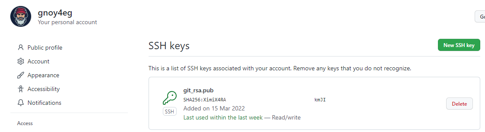

# Домашнее задание к занятию "8.4 Работа с Roles"

## Подготовка к выполнению
1. Создайте два пустых публичных репозитория в любом своём проекте: vector-role и lighthouse-role.  
Ответ:  
[vector-role](https://github.com/gnoy4eg/vector-role.git)  
[lighthouse-role](https://github.com/gnoy4eg/lighthouse-role.git)
2. Добавьте публичную часть своего ключа к своему профилю в github.  
Ответ:  
<p align="left">
  
</p> 


## Основная часть

Наша основная цель - разбить наш playbook на отдельные roles. Задача: сделать roles для clickhouse, vector и lighthouse и написать playbook для использования этих ролей. Ожидаемый результат: существуют три ваших репозитория: два с roles и один с playbook.

1. Создать в старой версии playbook файл `requirements.yml` и заполнить его следующим содержимым:

   ```yaml
   ---
     - src: git@github.com:AlexeySetevoi/ansible-clickhouse.git
       scm: git
       version: "1.11.0"
       name: clickhouse 
   ```
Ответ:  
Заполнил.
2. При помощи `ansible-galaxy` скачать себе эту роль.  
Ответ:  
```bash
[gnoy@manjarokde-ws01 terraform]$ ansible-galaxy install -r ../ansible/requirements.yml -p ../ansible/roles --force
Starting galaxy role install process
- extracting clickhouse to /home/gnoy/08.ansible.netology.devops.pub/src/ansible/roles/clickhouse
- clickhouse (1.11.0) was installed successfully
- extracting vector to /home/gnoy/08.ansible.netology.devops.pub/src/ansible/roles/vector
- vector (1.0.0) was installed successfully
- extracting lighthouse to /home/gnoy/08.ansible.netology.devops.pub/src/ansible/roles/lighthouse
- lighthouse (1.1.0) was installed successfully
```
3. Создать новый каталог с ролью при помощи `ansible-galaxy role init vector-role`.  
Ответ:  
```bash
[gnoy@manjarokde-ws01 lighthouse-role]$ ansible-galaxy role init vector-role
- Role vector-role was created successfully
[gnoy@manjarokde-ws01 lighthouse-role]$ 
```
4. На основе tasks из старого playbook заполните новую role. Разнесите переменные между `vars` и `default`.   
Ответ:  
Разнес.
5. Перенести нужные шаблоны конфигов в `templates`.  
Ответ:  
У меня нет шаблонов
6. Описать в `README.md` обе роли и их параметры.  
Ответ:  
Описал
7. Повторите шаги 3-6 для lighthouse. Помните, что одна роль должна настраивать один продукт.  
Ответ:  
Повторил. Настраивает.
8. Выложите все roles в репозитории. Проставьте тэги, используя семантическую нумерацию Добавьте roles в `requirements.yml` в playbook.  
Ответ:  
```yml
---
- name: clickhouse
  src: git@github.com:AlexeySetevoi/ansible-clickhouse.git
  scm: git
  version: "1.11.0"

- name: vector
  src: git@github.com:gnoy4eg/vector-role.git
  scm: git
  version: "1.0.0"

- name: lighthouse
  src: git@github.com:gnoy4eg/lighthouse-role.git
  scm: git
  version: "1.1.0"
```
9. Переработайте playbook на использование roles. Не забудьте про зависимости lighthouse и возможности совмещения `roles` с `tasks`.  
Ответ:  
```yml
- name: Install clickhouse
  hosts: clickhouse
  become: true
  become_user: root
  remote_user: centos
  roles:
    - clickhouse
  tasks:
  - name: Create database
    ansible.builtin.command: "clickhouse-client -q 'create database logs;'"
    register: create_db
    failed_when: create_db.rc != 0 and create_db.rc !=82
    changed_when: create_db.rc == 0
```
10. Выложите playbook в репозиторий.  
Ответ:  
[08.ansible.netology.devops.pub](https://github.com/gnoy4eg/08.ansible.netology.devops.pub.git)
11. В ответ приведите ссылки на оба репозитория с roles и одну ссылку на репозиторий с playbook.  
Ответ:  
Хорошо.
