# Домашнее задание к занятию "09.04 Jenkins"

## Подготовка к выполнению

1. Создать 2 VM: для jenkins-master и jenkins-agent.
2. Установить jenkins при помощи playbook'a.
3. Запустить и проверить работоспособность.
4. Сделать первоначальную настройку.  
Ответ:  
Первоначальную настройку произвел. Запустил мастера и агента.
<p align="left">
  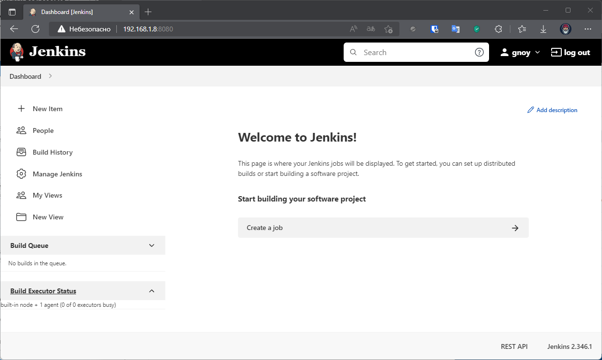
</p> 

<p align="left">
  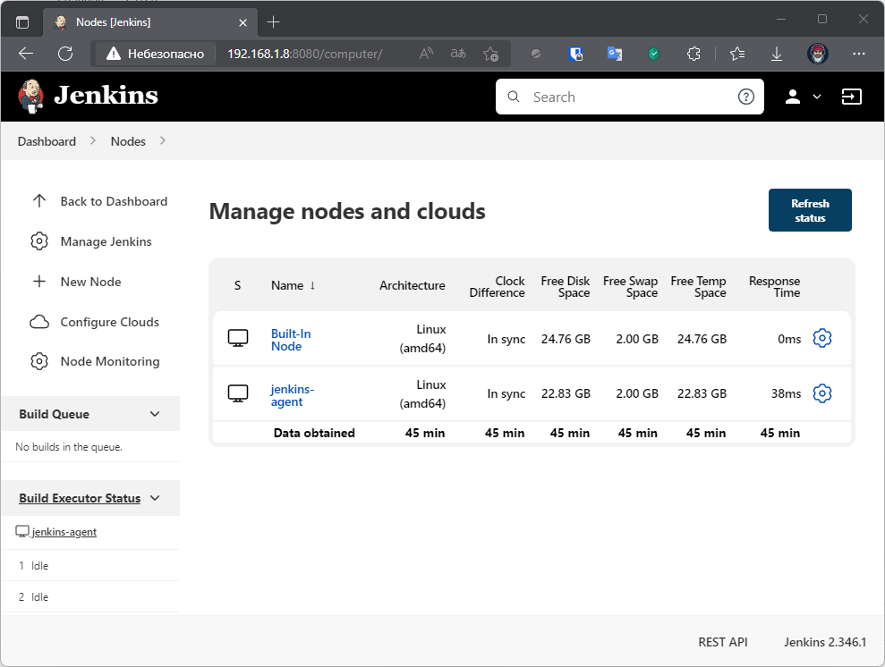
</p> 


## Основная часть

1. Сделать Freestyle Job, который будет запускать `molecule test` из любого вашего репозитория с ролью.  
Ответ:  
Настройки:
<p align="left">
  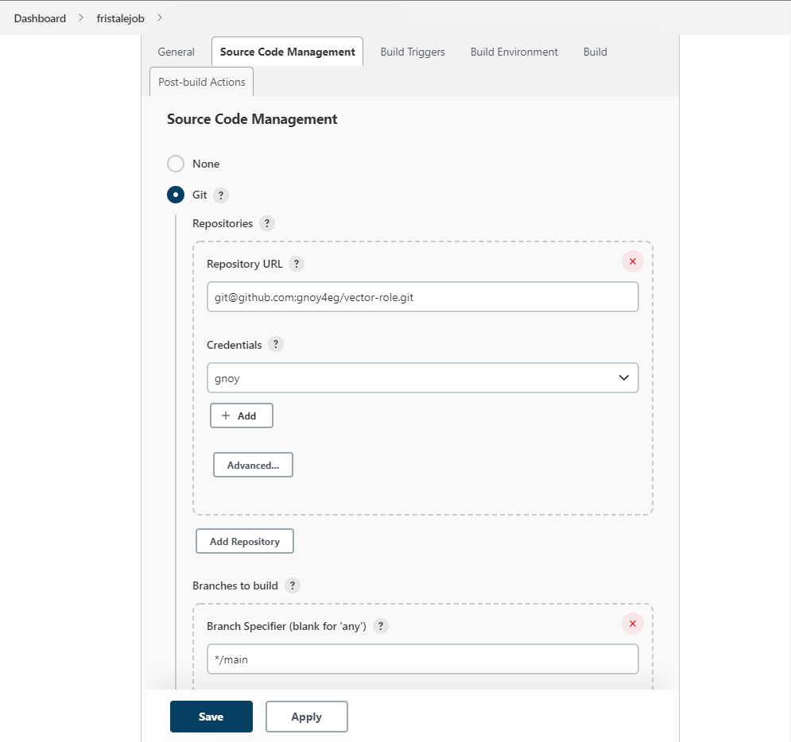
</p> 
<p align="left">
  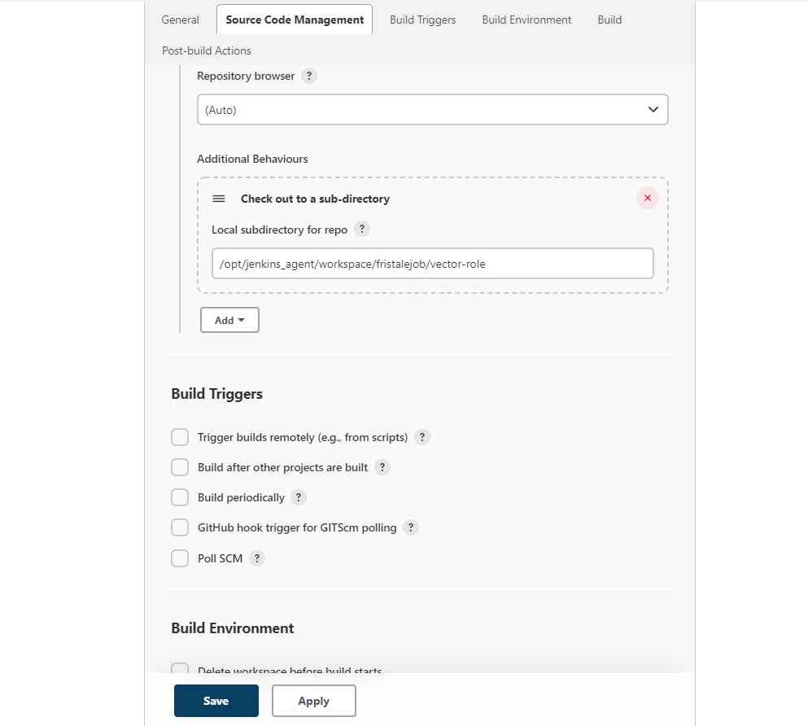
</p> 
<p align="left">
  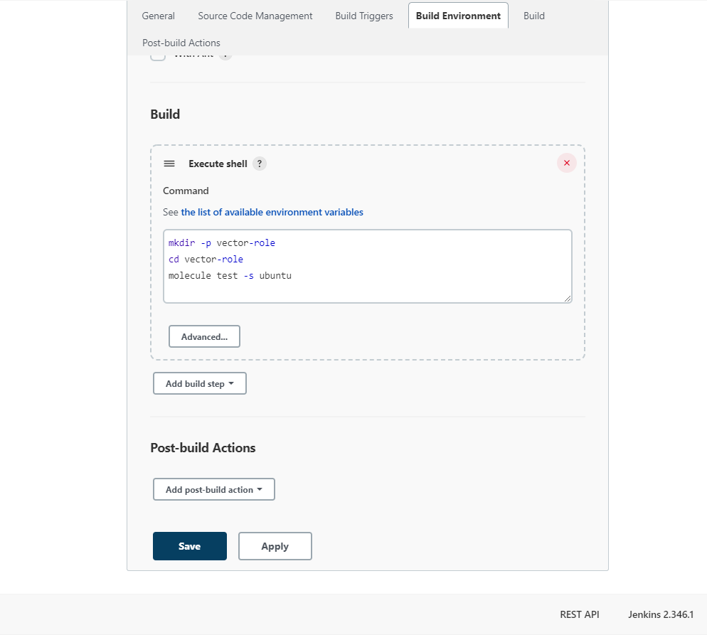
</p> 
Успешное тестирование:
<p align="left">
  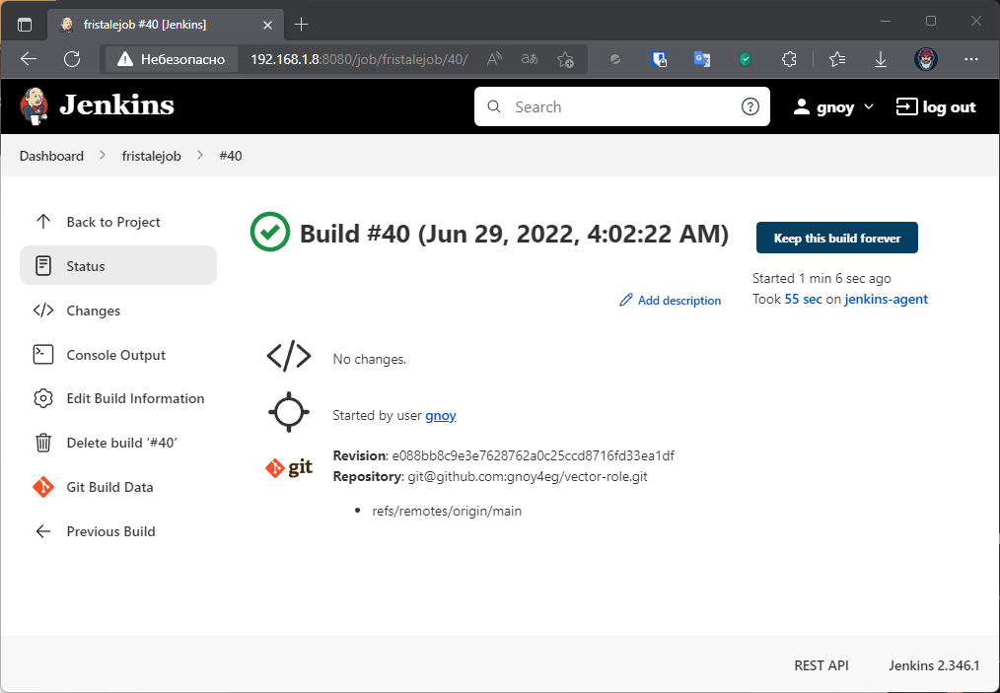
</p> 

  <details>
      <summary>Вывод с консоли</summary>

  ```bash
  Started by user gnoy
  Running as SYSTEM
  Building remotely on jenkins-agent in workspace /opt/jenkins_agent/workspace/fristalejob
  The recommended git tool is: NONE
  using credential 4f9fa63b-443b-4486-8cae-8f79079d62d9
  Cloning the remote Git repository
  Cloning repository git@github.com:gnoy4eg/vector-role.git
   > git init /opt/jenkins_agent/workspace/fristalejob/vector-role # timeout=10
  Fetching upstream changes from git@github.com:gnoy4eg/vector-role.git
   > git --version # timeout=10
   > git --version # 'git version 1.8.3.1'
  using GIT_SSH to set credentials 
  [INFO] Currently running in a labeled security context
  [INFO] Currently SELinux is 'enforcing' on the host
   > /usr/bin/chcon --type=ssh_home_t /opt/jenkins_agent/workspace/fristalejob/vector-role@tmp/ jenkins-gitclient-ssh13530690285359753864.key
   > git fetch --tags --progress git@github.com:gnoy4eg/vector-role.git +refs/heads/*:refs/remotes/origin/* # timeout=10
   > git config remote.origin.url git@github.com:gnoy4eg/vector-role.git # timeout=10
   > git config --add remote.origin.fetch +refs/heads/*:refs/remotes/origin/* # timeout=10
  Avoid second fetch
   > git rev-parse refs/remotes/origin/main^{commit} # timeout=10
  Checking out Revision e088bb8c9e3e7628762a0c25ccd8716fd33ea1df (refs/remotes/origin/main)
   > git config core.sparsecheckout # timeout=10
   > git checkout -f e088bb8c9e3e7628762a0c25ccd8716fd33ea1df # timeout=10
  Commit message: "update req"
   > git rev-list --no-walk e088bb8c9e3e7628762a0c25ccd8716fd33ea1df # timeout=10
  [fristalejob] $ /bin/sh -xe /tmp/jenkins3176198888360959638.sh
  + mkdir -p vector-role
  + cd vector-role
  + molecule test -s ubuntu
  /home/jenkins/.local/lib/python3.6/site-packages/requests/__init__.py:104: RequestsDependencyWarning: urllib3 (1.26.9) or chardet   (5.0.0)/charset_normalizer (2.0.12) doesn't match a supported version!
    RequestsDependencyWarning)
  INFO     ubuntu scenario test matrix: dependency, lint, cleanup, destroy, syntax, create, prepare, converge, idempotence,   side_effect, verify, cleanup, destroy
  INFO     Performing prerun...
  INFO     Guessed /opt/jenkins_agent/workspace/fristalejob/vector-role as project root directory
  INFO     Running ubuntu > dependency
  WARNING  Skipping, missing the requirements file.
  WARNING  Skipping, missing the requirements file.
  INFO     Running ubuntu > lint
  INFO     Lint is disabled.
  INFO     Running ubuntu > cleanup
  WARNING  Skipping, cleanup playbook not configured.
  INFO     Running ubuntu > destroy
  INFO     Sanity checks: 'docker'

  PLAY [Destroy] *****************************************************************

  TASK [Destroy molecule instance(s)] ********************************************
  changed: [localhost] => (item=instance)

  TASK [Wait for instance(s) deletion to complete] *******************************
  FAILED - RETRYING: Wait for instance(s) deletion to complete (300 retries left).
  ok: [localhost] => (item={'started': 1, 'finished': 0, 'ansible_job_id': '882637402137.14285', 'results_file': '/home/jenkins/. ansible_async/882637402137.14285', 'changed': True, 'failed': False, 'item': {'image': 'pycontribs/ubuntu:latest', 'name':   'instance', 'pre_build_image': True}, 'ansible_loop_var': 'item'})

  TASK [Delete docker network(s)] ************************************************

  PLAY RECAP *********************************************************************
  localhost                  : ok=2    changed=1    unreachable=0    failed=0    skipped=1    rescued=0    ignored=0

  INFO     Running ubuntu > syntax

  playbook: /opt/jenkins_agent/workspace/fristalejob/vector-role/molecule/ubuntu/converge.yml
  INFO     Running ubuntu > create

  PLAY [Create] ******************************************************************

  TASK [Log into a Docker registry] **********************************************
  skipping: [localhost] => (item={'image': 'pycontribs/ubuntu:latest', 'name': 'instance', 'pre_build_image': True})

  TASK [Check presence of custom Dockerfiles] ************************************
  ok: [localhost] => (item={'image': 'pycontribs/ubuntu:latest', 'name': 'instance', 'pre_build_image': True})

  TASK [Create Dockerfiles from image names] *************************************
  skipping: [localhost] => (item={'image': 'pycontribs/ubuntu:latest', 'name': 'instance', 'pre_build_image': True})

  TASK [Discover local Docker images] ********************************************
  ok: [localhost] => (item={'changed': False, 'skipped': True, 'skip_reason': 'Conditional result was False', 'item': {'image':   'pycontribs/ubuntu:latest', 'name': 'instance', 'pre_build_image': True}, 'ansible_loop_var': 'item', 'i': 0, 'ansible_index_var':  'i'})

  TASK [Build an Ansible compatible image (new)] *********************************
  skipping: [localhost] => (item=molecule_local/pycontribs/ubuntu:latest)

  TASK [Create docker network(s)] ************************************************

  TASK [Determine the CMD directives] ********************************************
  ok: [localhost] => (item={'image': 'pycontribs/ubuntu:latest', 'name': 'instance', 'pre_build_image': True})

  TASK [Create molecule instance(s)] *********************************************
  changed: [localhost] => (item=instance)

  TASK [Wait for instance(s) creation to complete] *******************************
  FAILED - RETRYING: Wait for instance(s) creation to complete (300 retries left).
  changed: [localhost] => (item={'started': 1, 'finished': 0, 'ansible_job_id': '74312539715.14470', 'results_file': '/home/jenkins/. ansible_async/74312539715.14470', 'changed': True, 'failed': False, 'item': {'image': 'pycontribs/ubuntu:latest', 'name':  'instance', 'pre_build_image': True}, 'ansible_loop_var': 'item'})

  PLAY RECAP *********************************************************************
  localhost                  : ok=5    changed=2    unreachable=0    failed=0    skipped=4    rescued=0    ignored=0

  INFO     Running ubuntu > prepare
  WARNING  Skipping, prepare playbook not configured.
  INFO     Running ubuntu > converge

  PLAY [Converge] ****************************************************************

  TASK [Gathering Facts] *********************************************************
  ok: [instance]

  TASK [Include vector-role] *****************************************************

  TASK [vector-role : Get Vector distrib | CentOS] *******************************
  skipping: [instance]

  TASK [vector-role : Get Vector distrib | Ubuntu] *******************************
  changed: [instance]

  TASK [vector-role : Install Vector packages | CentOS] **************************
  skipping: [instance]

  TASK [vector-role : Install Vector packages | Ubuntu] **************************
  changed: [instance]

  TASK [vector-role : Deploy config Vector] **************************************
  [WARNING]: The value "0" (type int) was converted to "'0'" (type string). If
  this does not look like what you expect, quote the entire value to ensure it
  does not change.
  changed: [instance]

  TASK [vector-role : Creates directory] *****************************************
  changed: [instance]

  TASK [vector-role : Create systemd unit Vector] ********************************
  changed: [instance]

  TASK [vector-role : Start Vector service] **************************************
  skipping: [instance]

  RUNNING HANDLER [vector-role : Start Vector service] ***************************
  skipping: [instance]

  PLAY RECAP *********************************************************************
  instance                   : ok=6    changed=5    unreachable=0    failed=0    skipped=4    rescued=0    ignored=0

  INFO     Running ubuntu > idempotence

  PLAY [Converge] ****************************************************************

  TASK [Gathering Facts] *********************************************************
  ok: [instance]

  TASK [Include vector-role] *****************************************************

  TASK [vector-role : Get Vector distrib | CentOS] *******************************
  skipping: [instance]

  TASK [vector-role : Get Vector distrib | Ubuntu] *******************************
  ok: [instance]

  TASK [vector-role : Install Vector packages | CentOS] **************************
  skipping: [instance]

  TASK [vector-role : Install Vector packages | Ubuntu] **************************
  ok: [instance]

  TASK [vector-role : Deploy config Vector] **************************************
  [WARNING]: The value "0" (type int) was converted to "'0'" (type string). If
  this does not look like what you expect, quote the entire value to ensure it
  does not change.
  ok: [instance]

  TASK [vector-role : Creates directory] *****************************************
  ok: [instance]

  TASK [vector-role : Create systemd unit Vector] ********************************
  ok: [instance]

  TASK [vector-role : Start Vector service] **************************************
  skipping: [instance]

  PLAY RECAP *********************************************************************
  instance                   : ok=6    changed=0    unreachable=0    failed=0    skipped=3    rescued=0    ignored=0

  INFO     Idempotence completed successfully.
  INFO     Running ubuntu > side_effect
  WARNING  Skipping, side effect playbook not configured.
  INFO     Running ubuntu > verify
  INFO     Running Ansible Verifier

  PLAY [Verify] ******************************************************************

  TASK [Get Vector version] ******************************************************
  ok: [instance]

  TASK [Assert Vector instalation] ***********************************************
  ok: [instance] => {
      "changed": false,
      "msg": "All assertions passed"
  }

  TASK [Validation Vector configuration] *****************************************
  ok: [instance]

  TASK [Assert Vector validate config] *******************************************
  ok: [instance] => {
      "changed": false,
      "msg": "All assertions passed"
  }

  PLAY RECAP *********************************************************************
  instance                   : ok=4    changed=0    unreachable=0    failed=0    skipped=0    rescued=0    ignored=0

  INFO     Verifier completed successfully.
  INFO     Running ubuntu > cleanup
  WARNING  Skipping, cleanup playbook not configured.
  INFO     Running ubuntu > destroy

  PLAY [Destroy] *****************************************************************

  TASK [Destroy molecule instance(s)] ********************************************
  changed: [localhost] => (item=instance)

  TASK [Wait for instance(s) deletion to complete] *******************************
  FAILED - RETRYING: Wait for instance(s) deletion to complete (300 retries left).
  changed: [localhost] => (item={'started': 1, 'finished': 0, 'ansible_job_id': '114485412089.17850', 'results_file': '/home/jenkins/ .ansible_async/114485412089.17850', 'changed': True, 'failed': False, 'item': {'image': 'pycontribs/ubuntu:latest', 'name':  'instance', 'pre_build_image': True}, 'ansible_loop_var': 'item'})

  TASK [Delete docker network(s)] ************************************************

  PLAY RECAP *********************************************************************
  localhost                  : ok=2    changed=2    unreachable=0    failed=0    skipped=1    rescued=0    ignored=0

  INFO     Pruning extra files from scenario ephemeral directory
  Finished: SUCCESS
  ```
  </details>
<br>

2. Сделать Declarative Pipeline Job, который будет запускать `molecule test` из любого вашего репозитория с ролью.  
Ответ:  
```groovy
pipeline {
    agent {
        label 'linux'
    } 
    stages {
        stage('git pull') {
            steps {
                git branch: 'main', credentialsId: '4f9fa63b-443b-4486-8cae-8f79079d62d9', url: 'git@github.com:gnoy4eg/vector-role.git'
            }
        }
        stage('molecule test') {
            steps {
                sh 'molecule test -s $NAME'
            }
        }
    }
}      
```
3. Перенести Declarative Pipeline в репозиторий в файл `Jenkinsfile`.  
Ответ:  
[Jenkinsfile](https://github.com/gnoy4eg/vector-role/blob/main/Jenkinsfile)

4. Создать Multibranch Pipeline на запуск `Jenkinsfile` из репозитория.  
Ответ:  
<p align="left">
  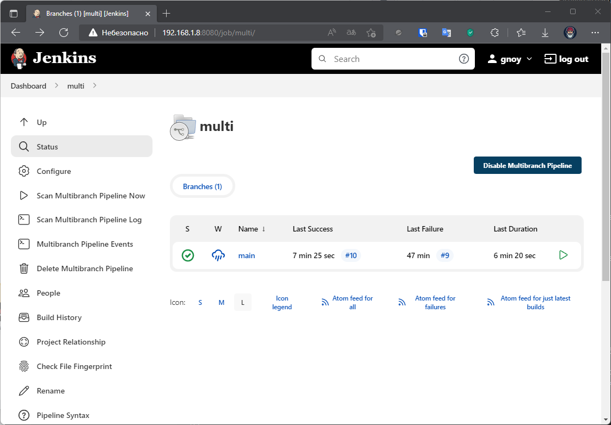
</p> 

<details>
      <summary>Scan Multibranch Pipeline Log</summary>

```bash
Started by user gnoy
[Wed Jun 29 11:12:11 YEKT 2022] Starting branch indexing...
 > git --version # timeout=10
 > git --version # 'git version 1.8.3.1'
using GIT_SSH to set credentials 
[INFO] Currently running in a labeled security context
[INFO] Currently SELinux is 'enforcing' on the host
 > /usr/bin/chcon --type=ssh_home_t /tmp/jenkins-gitclient-ssh6529442523392904479.key
 > git ls-remote git@github.com:gnoy4eg/vector-role.git # timeout=10
 > git rev-parse --resolve-git-dir /var/lib/jenkins/caches/git-88a36046350391df2df605ec2c65669c/.git # timeout=10
Setting origin to git@github.com:gnoy4eg/vector-role.git
 > git config remote.origin.url git@github.com:gnoy4eg/vector-role.git # timeout=10
Fetching & pruning origin...
Listing remote references...
 > git config --get remote.origin.url # timeout=10
 > git --version # timeout=10
 > git --version # 'git version 1.8.3.1'
using GIT_SSH to set credentials 
[INFO] Currently running in a labeled security context
[INFO] Currently SELinux is 'enforcing' on the host
 > /usr/bin/chcon --type=ssh_home_t /var/lib/jenkins/caches/git-88a36046350391df2df605ec2c65669c@tmp/jenkins-gitclient-ssh15128974954821347073.key
 > git ls-remote -h git@github.com:gnoy4eg/vector-role.git # timeout=10
Fetching upstream changes from origin
 > git config --get remote.origin.url # timeout=10
using GIT_SSH to set credentials 
[INFO] Currently running in a labeled security context
[INFO] Currently SELinux is 'enforcing' on the host
 > /usr/bin/chcon --type=ssh_home_t /var/lib/jenkins/caches/git-88a36046350391df2df605ec2c65669c@tmp/jenkins-gitclient-ssh18445616227534336368.key
 > git fetch --tags --progress --prune origin +refs/heads/*:refs/remotes/origin/* # timeout=10
Checking branches...
  Checking branch main
      ‘Jenkinsfile’ found
    Met criteria
Changes detected: main (db8784687b531d15f542e16e6f51807da85dd114 → 3282212041d99a1d81f04ada42e59a9917837842)
Scheduled build for branch: main
Processed 1 branches
[Wed Jun 29 11:12:16 YEKT 2022] Finished branch indexing. Indexing took 4.7 sec
Finished: SUCCESS
```
</details>
<br>
<p align="left">
  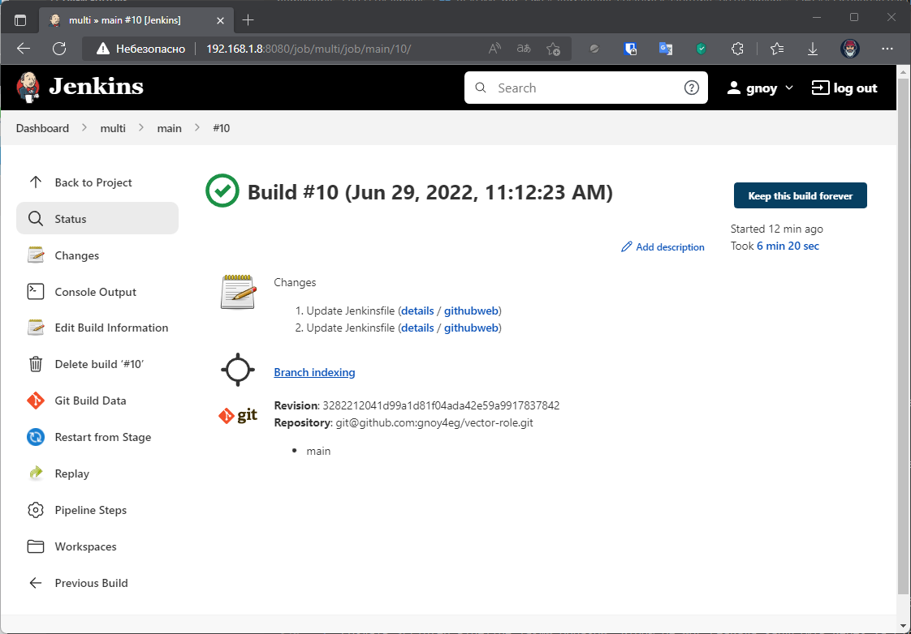
</p> 
<br>
<details>
      <summary>Console Output Multibranch Pipeline</summary>

```bash
Branch indexing
 > git rev-parse --resolve-git-dir /var/lib/jenkins/caches/git-88a36046350391df2df605ec2c65669c/.git # timeout=10
Setting origin to git@github.com:gnoy4eg/vector-role.git
 > git config remote.origin.url git@github.com:gnoy4eg/vector-role.git # timeout=10
Fetching origin...
Fetching upstream changes from origin
 > git --version # timeout=10
 > git --version # 'git version 1.8.3.1'
 > git config --get remote.origin.url # timeout=10
using GIT_SSH to set credentials 
[INFO] Currently running in a labeled security context
[INFO] Currently SELinux is 'enforcing' on the host
 > /usr/bin/chcon --type=ssh_home_t /var/lib/jenkins/caches/git-88a36046350391df2df605ec2c65669c@tmp/jenkins-gitclient-ssh11663179483016974595.key
 > git fetch --tags --progress origin +refs/heads/*:refs/remotes/origin/* # timeout=10
Seen branch in repository origin/main
Seen 1 remote branch
Obtained Jenkinsfile from 3282212041d99a1d81f04ada42e59a9917837842
[Pipeline] Start of Pipeline
[Pipeline] node
Still waiting to schedule task
‘jenkins-agent’ is offline
Running on jenkins-agent in /opt/jenkins_agent/workspace/multi_main
[Pipeline] {
[Pipeline] stage
[Pipeline] { (Declarative: Checkout SCM)
[Pipeline] checkout
Selected Git installation does not exist. Using Default
The recommended git tool is: NONE
using credential 4f9fa63b-443b-4486-8cae-8f79079d62d9
Fetching changes from the remote Git repository
Fetching without tags
 > git rev-parse --resolve-git-dir /opt/jenkins_agent/workspace/multi_main/.git # timeout=10
 > git config remote.origin.url git@github.com:gnoy4eg/vector-role.git # timeout=10
Fetching upstream changes from git@github.com:gnoy4eg/vector-role.git
 > git --version # timeout=10
 > git --version # 'git version 1.8.3.1'
using GIT_SSH to set credentials 
[INFO] Currently running in a labeled security context
[INFO] Currently SELinux is 'enforcing' on the host
 > /usr/bin/chcon --type=ssh_home_t /opt/jenkins_agent/workspace/multi_main@tmp/jenkins-gitclient-ssh3073276050753873827.key
 > git fetch --no-tags --progress git@github.com:gnoy4eg/vector-role.git +refs/heads/*:refs/remotes/origin/* # timeout=10
Checking out Revision 3282212041d99a1d81f04ada42e59a9917837842 (main)
Commit message: "Update Jenkinsfile"
 > git config core.sparsecheckout # timeout=10
 > git checkout -f 3282212041d99a1d81f04ada42e59a9917837842 # timeout=10
 > git rev-list --no-walk eebab95195c6823da95671ba0f0f0652f54700c5 # timeout=10
[Pipeline] }
[Pipeline] // stage
[Pipeline] withEnv
[Pipeline] {
[Pipeline] stage
[Pipeline] { (git pull)
[Pipeline] git
Selected Git installation does not exist. Using Default
The recommended git tool is: NONE
using credential 4f9fa63b-443b-4486-8cae-8f79079d62d9
Fetching changes from the remote Git repository
 > git rev-parse --resolve-git-dir /opt/jenkins_agent/workspace/multi_main/.git # timeout=10
 > git config remote.origin.url git@github.com:gnoy4eg/vector-role.git # timeout=10
Fetching upstream changes from git@github.com:gnoy4eg/vector-role.git
 > git --version # timeout=10
 > git --version # 'git version 1.8.3.1'
using GIT_SSH to set credentials 
[INFO] Currently running in a labeled security context
[INFO] Currently SELinux is 'enforcing' on the host
 > /usr/bin/chcon --type=ssh_home_t /opt/jenkins_agent/workspace/multi_main@tmp/jenkins-gitclient-ssh15396289228636400063.key
 > git fetch --tags --progress git@github.com:gnoy4eg/vector-role.git +refs/heads/*:refs/remotes/origin/* # timeout=10
Checking out Revision 3282212041d99a1d81f04ada42e59a9917837842 (refs/remotes/origin/main)
Commit message: "Update Jenkinsfile"
[Pipeline] }
[Pipeline] // stage
[Pipeline] stage
[Pipeline] { (molecule test)
[Pipeline] sh
 > git rev-parse refs/remotes/origin/main^{commit} # timeout=10
 > git config core.sparsecheckout # timeout=10
 > git checkout -f 3282212041d99a1d81f04ada42e59a9917837842 # timeout=10
 > git branch -a -v --no-abbrev # timeout=10
 > git branch -D main # timeout=10
 > git checkout -b main 3282212041d99a1d81f04ada42e59a9917837842 # timeout=10
+ molecule test -s centos
/home/jenkins/.local/lib/python3.6/site-packages/requests/__init__.py:104: RequestsDependencyWarning: urllib3 (1.26.9) or chardet (5.0.0)/charset_normalizer (2.0.12) doesn't match a supported version!
  RequestsDependencyWarning)
INFO     centos scenario test matrix: dependency, lint, cleanup, destroy, syntax, create, prepare, converge, idempotence, side_effect, verify, cleanup, destroy
INFO     Performing prerun...
INFO     Guessed /opt/jenkins_agent/workspace/multi_main as project root directory
INFO     Running centos > dependency
WARNING  Skipping, missing the requirements file.
WARNING  Skipping, missing the requirements file.
INFO     Running centos > lint
INFO     Lint is disabled.
INFO     Running centos > cleanup
WARNING  Skipping, cleanup playbook not configured.
INFO     Running centos > destroy
INFO     Sanity checks: 'docker'

PLAY [Destroy] *****************************************************************

TASK [Destroy molecule instance(s)] ********************************************
changed: [localhost] => (item=instance)

TASK [Wait for instance(s) deletion to complete] *******************************
FAILED - RETRYING: Wait for instance(s) deletion to complete (300 retries left).
ok: [localhost] => (item={'started': 1, 'finished': 0, 'ansible_job_id': '670468931633.2528', 'results_file': '/home/jenkins/.ansible_async/670468931633.2528', 'changed': True, 'failed': False, 'item': {'image': 'docker.io/pycontribs/centos:7', 'name': 'instance', 'pre_build_image': True}, 'ansible_loop_var': 'item'})

TASK [Delete docker network(s)] ************************************************

PLAY RECAP *********************************************************************
localhost                  : ok=2    changed=1    unreachable=0    failed=0    skipped=1    rescued=0    ignored=0

INFO     Running centos > syntax

playbook: /opt/jenkins_agent/workspace/multi_main/molecule/centos/converge.yml
INFO     Running centos > create

PLAY [Create] ******************************************************************

TASK [Log into a Docker registry] **********************************************
skipping: [localhost] => (item={'image': 'docker.io/pycontribs/centos:7', 'name': 'instance', 'pre_build_image': True})

TASK [Check presence of custom Dockerfiles] ************************************
ok: [localhost] => (item={'image': 'docker.io/pycontribs/centos:7', 'name': 'instance', 'pre_build_image': True})

TASK [Create Dockerfiles from image names] *************************************
skipping: [localhost] => (item={'image': 'docker.io/pycontribs/centos:7', 'name': 'instance', 'pre_build_image': True})

TASK [Discover local Docker images] ********************************************
ok: [localhost] => (item={'changed': False, 'skipped': True, 'skip_reason': 'Conditional result was False', 'item': {'image': 'docker.io/pycontribs/centos:7', 'name': 'instance', 'pre_build_image': True}, 'ansible_loop_var': 'item', 'i': 0, 'ansible_index_var': 'i'})

TASK [Build an Ansible compatible image (new)] *********************************
skipping: [localhost] => (item=molecule_local/docker.io/pycontribs/centos:7)

TASK [Create docker network(s)] ************************************************

TASK [Determine the CMD directives] ********************************************
ok: [localhost] => (item={'image': 'docker.io/pycontribs/centos:7', 'name': 'instance', 'pre_build_image': True})

TASK [Create molecule instance(s)] *********************************************
changed: [localhost] => (item=instance)

TASK [Wait for instance(s) creation to complete] *******************************
FAILED - RETRYING: Wait for instance(s) creation to complete (300 retries left).
changed: [localhost] => (item={'started': 1, 'finished': 0, 'ansible_job_id': '390685300317.2734', 'results_file': '/home/jenkins/.ansible_async/390685300317.2734', 'changed': True, 'failed': False, 'item': {'image': 'docker.io/pycontribs/centos:7', 'name': 'instance', 'pre_build_image': True}, 'ansible_loop_var': 'item'})

PLAY RECAP *********************************************************************
localhost                  : ok=5    changed=2    unreachable=0    failed=0    skipped=4    rescued=0    ignored=0

INFO     Running centos > prepare
WARNING  Skipping, prepare playbook not configured.
INFO     Running centos > converge

PLAY [Converge] ****************************************************************

TASK [Gathering Facts] *********************************************************
ok: [instance]

TASK [Include vector-role] *****************************************************

TASK [vector-role : Get Vector distrib | CentOS] *******************************
changed: [instance]

TASK [vector-role : Get Vector distrib | Ubuntu] *******************************
skipping: [instance]

TASK [vector-role : Install Vector packages | CentOS] **************************
changed: [instance]

TASK [vector-role : Install Vector packages | Ubuntu] **************************
skipping: [instance]

TASK [vector-role : Deploy config Vector] **************************************
[WARNING]: The value "0" (type int) was converted to "u'0'" (type string). If
this does not look like what you expect, quote the entire value to ensure it
does not change.
changed: [instance]

TASK [vector-role : Creates directory] *****************************************
changed: [instance]

TASK [vector-role : Create systemd unit Vector] ********************************
changed: [instance]

TASK [vector-role : Start Vector service] **************************************
skipping: [instance]

RUNNING HANDLER [vector-role : Start Vector service] ***************************
skipping: [instance]

PLAY RECAP *********************************************************************
instance                   : ok=6    changed=5    unreachable=0    failed=0    skipped=4    rescued=0    ignored=0

INFO     Running centos > idempotence

PLAY [Converge] ****************************************************************

TASK [Gathering Facts] *********************************************************
ok: [instance]

TASK [Include vector-role] *****************************************************

TASK [vector-role : Get Vector distrib | CentOS] *******************************
ok: [instance]

TASK [vector-role : Get Vector distrib | Ubuntu] *******************************
skipping: [instance]

TASK [vector-role : Install Vector packages | CentOS] **************************
ok: [instance]

TASK [vector-role : Install Vector packages | Ubuntu] **************************
skipping: [instance]

TASK [vector-role : Deploy config Vector] **************************************
[WARNING]: The value "0" (type int) was converted to "u'0'" (type string). If
this does not look like what you expect, quote the entire value to ensure it
does not change.
ok: [instance]

TASK [vector-role : Creates directory] *****************************************
ok: [instance]

TASK [vector-role : Create systemd unit Vector] ********************************
ok: [instance]

TASK [vector-role : Start Vector service] **************************************
skipping: [instance]

PLAY RECAP *********************************************************************
instance                   : ok=6    changed=0    unreachable=0    failed=0    skipped=3    rescued=0    ignored=0

INFO     Idempotence completed successfully.
INFO     Running centos > side_effect
WARNING  Skipping, side effect playbook not configured.
INFO     Running centos > verify
INFO     Running Ansible Verifier

PLAY [Verify] ******************************************************************

TASK [Get Vector version] ******************************************************
ok: [instance]

TASK [Assert Vector instalation] ***********************************************
ok: [instance] => {
    "changed": false,
    "msg": "All assertions passed"
}

TASK [Validation Vector configuration] *****************************************
ok: [instance]

TASK [Assert Vector validate config] *******************************************
ok: [instance] => {
    "changed": false,
    "msg": "All assertions passed"
}

PLAY RECAP *********************************************************************
instance                   : ok=4    changed=0    unreachable=0    failed=0    skipped=0    rescued=0    ignored=0

INFO     Verifier completed successfully.
INFO     Running centos > cleanup
WARNING  Skipping, cleanup playbook not configured.
INFO     Running centos > destroy

PLAY [Destroy] *****************************************************************

TASK [Destroy molecule instance(s)] ********************************************
changed: [localhost] => (item=instance)

TASK [Wait for instance(s) deletion to complete] *******************************
FAILED - RETRYING: Wait for instance(s) deletion to complete (300 retries left).
changed: [localhost] => (item={'started': 1, 'finished': 0, 'ansible_job_id': '84629688008.6083', 'results_file': '/home/jenkins/.ansible_async/84629688008.6083', 'changed': True, 'failed': False, 'item': {'image': 'docker.io/pycontribs/centos:7', 'name': 'instance', 'pre_build_image': True}, 'ansible_loop_var': 'item'})

TASK [Delete docker network(s)] ************************************************

PLAY RECAP *********************************************************************
localhost                  : ok=2    changed=2    unreachable=0    failed=0    skipped=1    rescued=0    ignored=0

INFO     Pruning extra files from scenario ephemeral directory
[Pipeline] }
[Pipeline] // stage
[Pipeline] }
[Pipeline] // withEnv
[Pipeline] }
[Pipeline] // node
[Pipeline] End of Pipeline
Finished: SUCCESS
```
</details>
<br>

5. Создать Scripted Pipeline, наполнить его скриптом из [pipeline](./src/pipeline/).  
Ответ:  
<p align="left">
  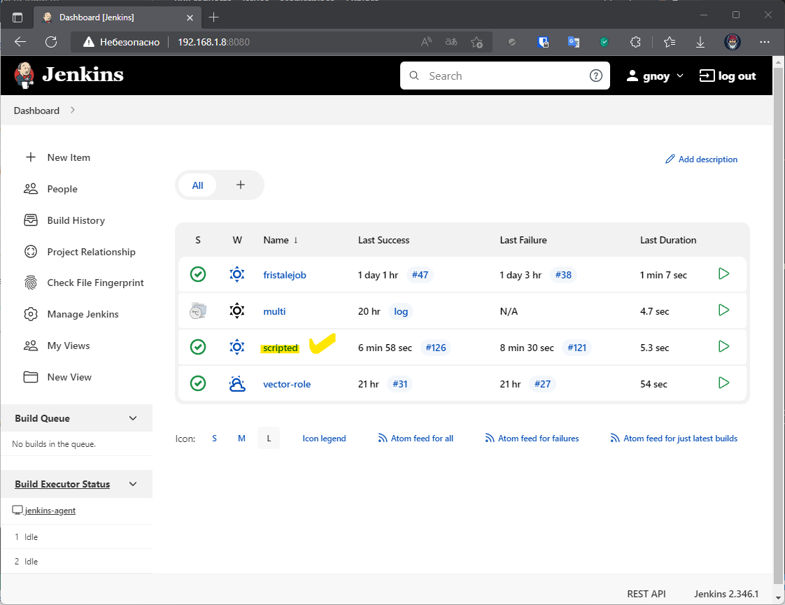
</p> 

6. Внести необходимые изменения, чтобы Pipeline запускал `ansible-playbook` без флагов `--check --diff`, если не установлен параметр при запуске джобы (prod_run = True), по умолчанию параметр имеет значение False и запускает прогон с флагами `--check --diff`.  
Ответ:  
<p align="left">
  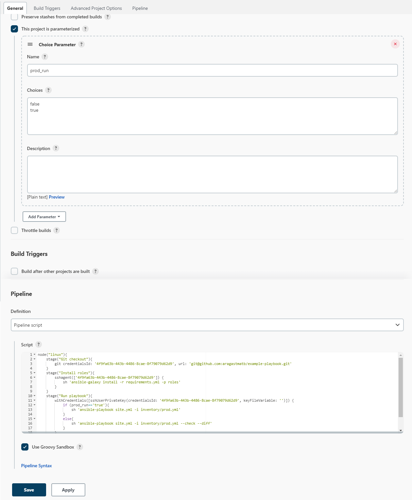
</p> 

7. Проверить работоспособность, исправить ошибки, исправленный Pipeline вложить в репозиторий в файл `ScriptedJenkinsfile`.  
Ответ:  
<p align="left">
  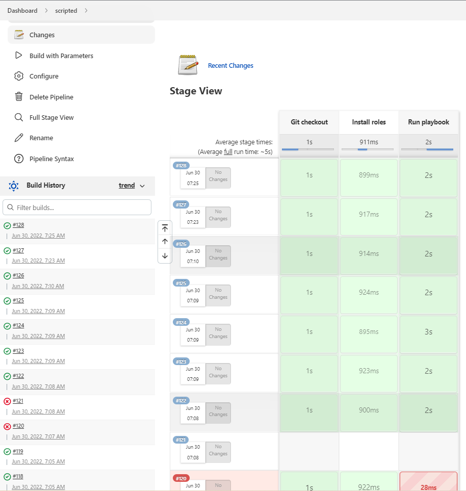
</p> 

<details>
      <summary>prod_run = False</summary>

```bash
Started by user gnoy
[Pipeline] Start of Pipeline
[Pipeline] node
Running on jenkins-agent in /opt/jenkins_agent/workspace/scripted
[Pipeline] {
[Pipeline] stage
[Pipeline] { (Git checkout)
[Pipeline] git
The recommended git tool is: NONE
using credential 4f9fa63b-443b-4486-8cae-8f79079d62d9
Fetching changes from the remote Git repository
 > git rev-parse --resolve-git-dir /opt/jenkins_agent/workspace/scripted/.git # timeout=10
 > git config remote.origin.url git@github.com:aragastmatb/example-playbook.git # timeout=10
Fetching upstream changes from git@github.com:aragastmatb/example-playbook.git
 > git --version # timeout=10
 > git --version # 'git version 1.8.3.1'
using GIT_SSH to set credentials 
[INFO] Currently running in a labeled security context
[INFO] Currently SELinux is 'enforcing' on the host
 > /usr/bin/chcon --type=ssh_home_t /opt/jenkins_agent/workspace/scripted@tmp/jenkins-gitclient-ssh6985679919423068670.key
 > git fetch --tags --progress git@github.com:aragastmatb/example-playbook.git +refs/heads/*:refs/remotes/origin/* # timeout=10
Checking out Revision 7c0b99e0464c8c4cf2ac3e9d802379edfe06df00 (refs/remotes/origin/master)
Commit message: "Update secret"
 > git rev-parse refs/remotes/origin/master^{commit} # timeout=10
 > git config core.sparsecheckout # timeout=10
 > git checkout -f 7c0b99e0464c8c4cf2ac3e9d802379edfe06df00 # timeout=10
 > git branch -a -v --no-abbrev # timeout=10
 > git branch -D master # timeout=10
 > git checkout -b master 7c0b99e0464c8c4cf2ac3e9d802379edfe06df00 # timeout=10
 > git rev-list --no-walk 7c0b99e0464c8c4cf2ac3e9d802379edfe06df00 # timeout=10
[Pipeline] }
[Pipeline] // stage
[Pipeline] stage
[Pipeline] { (Install roles)
[Pipeline] sshagent
[ssh-agent] Using credentials gnoy
[ssh-agent] Looking for ssh-agent implementation...
[ssh-agent]   Exec ssh-agent (binary ssh-agent on a remote machine)
$ ssh-agent
SSH_AUTH_SOCK=/tmp/ssh-80RO2PfTdut2/agent.28327
SSH_AGENT_PID=28328
Running ssh-add (command line suppressed)
Identity added: /opt/jenkins_agent/workspace/scripted@tmp/private_key_5119745399937180635.key (gnoy@LAPTOP-CHVMGVOQ)
[ssh-agent] Started.
[Pipeline] {
[Pipeline] sh
+ ansible-galaxy install -r requirements.yml -p roles
Starting galaxy role install process
- java (1.0.1) is already installed, skipping.
/home/jenkins/.local/lib/python3.6/site-packages/requests/__init__.py:104: RequestsDependencyWarning: urllib3 (1.26.9) or chardet (5.0.0)/charset_normalizer (2.0.12) doesn't match a supported version!
  RequestsDependencyWarning)
[Pipeline] }
$ ssh-agent -k
unset SSH_AUTH_SOCK;
unset SSH_AGENT_PID;
echo Agent pid 28328 killed;
[ssh-agent] Stopped.
[Pipeline] // sshagent
[Pipeline] }
[Pipeline] // stage
[Pipeline] stage
[Pipeline] { (Run playbook)
[Pipeline] withCredentials
Masking supported pattern matches of $
[Pipeline] {
[Pipeline] sh
+ ansible-playbook site.yml -i inventory/prod.yml --check --diff

PLAY [Install Java] ************************************************************

TASK [Gathering Facts] *********************************************************
ok: [localhost]

TASK [java : Upload .tar.gz file containing binaries from local storage] *******
skipping: [localhost]

TASK [java : Upload .tar.gz file conaining binaries from remote storage] *******
ok: [localhost]

TASK [java : Ensure installation dir exists] ***********************************
ok: [localhost]

TASK [java : Extract java in the installation directory] ***********************
skipping: [localhost]

TASK [java : Export environment variables] *************************************
ok: [localhost]

PLAY RECAP *********************************************************************
localhost                  : ok=4    changed=0    unreachable=0    failed=0    skipped=2    rescued=0    ignored=0   

[Pipeline] }
[Pipeline] // withCredentials
[Pipeline] }
[Pipeline] // stage
[Pipeline] }
[Pipeline] // node
[Pipeline] End of Pipeline
Finished: SUCCESS
```
</details>


<details>
      <summary>prod_run = True</summary>

```bash
Started by user gnoy
[Pipeline] Start of Pipeline
[Pipeline] node
Running on jenkins-agent in /opt/jenkins_agent/workspace/scripted
[Pipeline] {
[Pipeline] stage
[Pipeline] { (Git checkout)
[Pipeline] git
The recommended git tool is: NONE
using credential 4f9fa63b-443b-4486-8cae-8f79079d62d9
Fetching changes from the remote Git repository
 > git rev-parse --resolve-git-dir /opt/jenkins_agent/workspace/scripted/.git # timeout=10
 > git config remote.origin.url git@github.com:aragastmatb/example-playbook.git # timeout=10
Fetching upstream changes from git@github.com:aragastmatb/example-playbook.git
 > git --version # timeout=10
 > git --version # 'git version 1.8.3.1'
using GIT_SSH to set credentials 
[INFO] Currently running in a labeled security context
[INFO] Currently SELinux is 'enforcing' on the host
 > /usr/bin/chcon --type=ssh_home_t /opt/jenkins_agent/workspace/scripted@tmp/jenkins-gitclient-ssh17239376716362673143.key
 > git fetch --tags --progress git@github.com:aragastmatb/example-playbook.git +refs/heads/*:refs/remotes/origin/* # timeout=10
Checking out Revision 7c0b99e0464c8c4cf2ac3e9d802379edfe06df00 (refs/remotes/origin/master)
Commit message: "Update secret"
 > git rev-parse refs/remotes/origin/master^{commit} # timeout=10
 > git config core.sparsecheckout # timeout=10
 > git checkout -f 7c0b99e0464c8c4cf2ac3e9d802379edfe06df00 # timeout=10
 > git branch -a -v --no-abbrev # timeout=10
 > git branch -D master # timeout=10
 > git checkout -b master 7c0b99e0464c8c4cf2ac3e9d802379edfe06df00 # timeout=10
 > git rev-list --no-walk 7c0b99e0464c8c4cf2ac3e9d802379edfe06df00 # timeout=10
[Pipeline] }
[Pipeline] // stage
[Pipeline] stage
[Pipeline] { (Install roles)
[Pipeline] sshagent
[ssh-agent] Using credentials gnoy
[ssh-agent] Looking for ssh-agent implementation...
[ssh-agent]   Exec ssh-agent (binary ssh-agent on a remote machine)
$ ssh-agent
SSH_AUTH_SOCK=/tmp/ssh-LUHAkmzK3ZIp/agent.28715
SSH_AGENT_PID=28716
Running ssh-add (command line suppressed)
Identity added: /opt/jenkins_agent/workspace/scripted@tmp/private_key_3926481639246926297.key (gnoy@LAPTOP-CHVMGVOQ)
[ssh-agent] Started.
[Pipeline] {
[Pipeline] sh
+ ansible-galaxy install -r requirements.yml -p roles
Starting galaxy role install process
- java (1.0.1) is already installed, skipping.
/home/jenkins/.local/lib/python3.6/site-packages/requests/__init__.py:104: RequestsDependencyWarning: urllib3 (1.26.9) or chardet (5.0.0)/charset_normalizer (2.0.12) doesn't match a supported version!
  RequestsDependencyWarning)
[Pipeline] }
$ ssh-agent -k
unset SSH_AUTH_SOCK;
unset SSH_AGENT_PID;
echo Agent pid 28716 killed;
[ssh-agent] Stopped.
[Pipeline] // sshagent
[Pipeline] }
[Pipeline] // stage
[Pipeline] stage
[Pipeline] { (Run playbook)
[Pipeline] withCredentials
Masking supported pattern matches of $
[Pipeline] {
[Pipeline] sh
+ ansible-playbook site.yml -i inventory/prod.yml

PLAY [Install Java] ************************************************************

TASK [Gathering Facts] *********************************************************
ok: [localhost]

TASK [java : Upload .tar.gz file containing binaries from local storage] *******
skipping: [localhost]

TASK [java : Upload .tar.gz file conaining binaries from remote storage] *******
ok: [localhost]

TASK [java : Ensure installation dir exists] ***********************************
ok: [localhost]

TASK [java : Extract java in the installation directory] ***********************
skipping: [localhost]

TASK [java : Export environment variables] *************************************
ok: [localhost]

PLAY RECAP *********************************************************************
localhost                  : ok=4    changed=0    unreachable=0    failed=0    skipped=2    rescued=0    ignored=0   

[Pipeline] }
[Pipeline] // withCredentials
[Pipeline] }
[Pipeline] // stage
[Pipeline] }
[Pipeline] // node
[Pipeline] End of Pipeline
Finished: SUCCESS
```
</details>
<br>

8. Отправить ссылку на репозиторий с ролью и Declarative Pipeline и Scripted Pipeline.  
Ответ:  
[Declarative Pipeline](./src/pipeline/DeclarativeJenkinsfile)  
[Scripted Pipeline](./src/pipeline/ScriptedJenkinsfile)


## Необязательная часть

1. Создать скрипт на groovy, который будет собирать все Job, которые завершились хотя бы раз неуспешно. Добавить скрипт в репозиторий с решением с названием `AllJobFailure.groovy`.
2. Создать Scripted Pipeline таким образом, чтобы он мог сначала запустить через Ya.Cloud CLI необходимое количество инстансов, прописать их в инвентори плейбука и после этого запускать плейбук. Тем самым, мы должны по нажатию кнопки получить готовую к использованию систему.  
Ответ:  
Пока не добрался до этой задачи
