# Домашнее задание к занятию "09.05 Teamcity"

## Подготовка к выполнению

1. В Ya.Cloud создайте новый инстанс (4CPU4RAM) на основе образа `jetbrains/teamcity-server`  
Ответ:  
Развертываю ВМ в YC с помощью terraform [teamcity-server](./src/terraform/teamcity-server.tf)
2. Дождитесь запуска teamcity, выполните первоначальную настройку  
Ответ:  
<p align="left">
  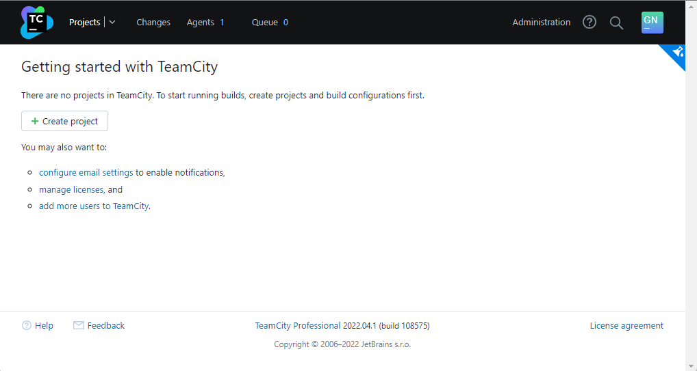
</p>

3. Создайте ещё один инстанс(2CPU4RAM) на основе образа `jetbrains/teamcity-agent`. Пропишите к нему переменную окружения `SERVER_URL: "http://<teamcity_url>:8111"`  
Ответ:  
Развертываю ВМ в YC с помощью terraform [teamcity-agent](./src/terraform/teamcity-agent.tf)
4. Авторизуйте агент  
Ответ:  
<p align="left">
  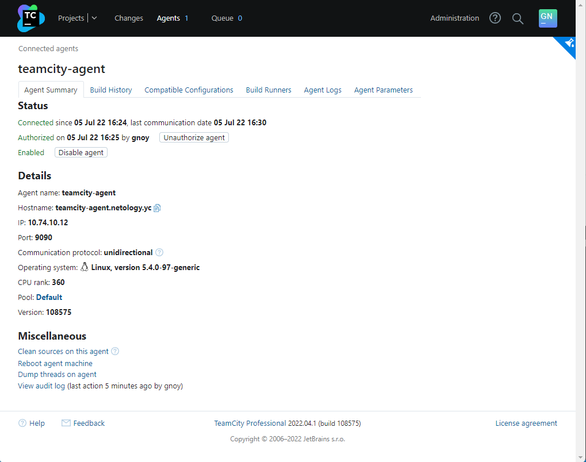
</p>

5. Сделайте fork [репозитория](https://github.com/aragastmatb/example-teamcity)  
Ответ:  
<p align="left">
  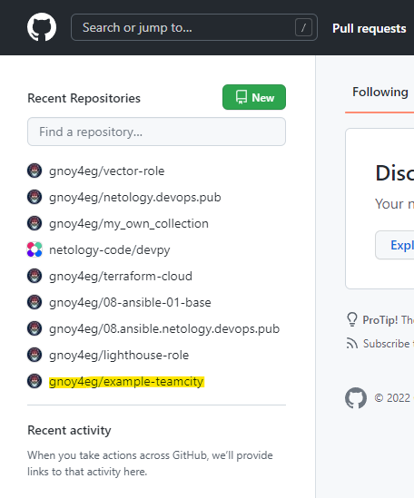
</p>

6. Создать VM (2CPU4RAM) и запустить [playbook](./src/infrastructure/)  
Ответ:  
Развертываю [nexus](./src/terraform/nexus.tf) в YC с помощью terraform. Плейбук запущу руками, не буду "дергать" его terraform'ом.

## Основная часть

1. Создайте новый проект в teamcity на основе fork  
Ответ:  
<p align="left">
  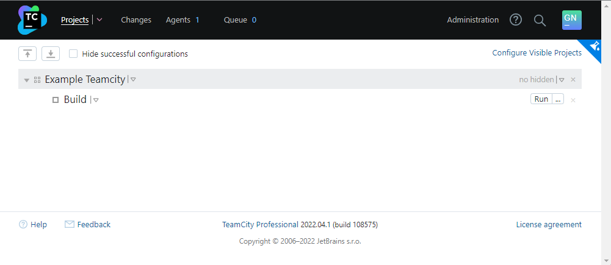
</p>

2. Сделайте autodetect конфигурации
3. Сохраните необходимые шаги, запустите первую сборку master'a  
Ответ:  
<p align="left">
  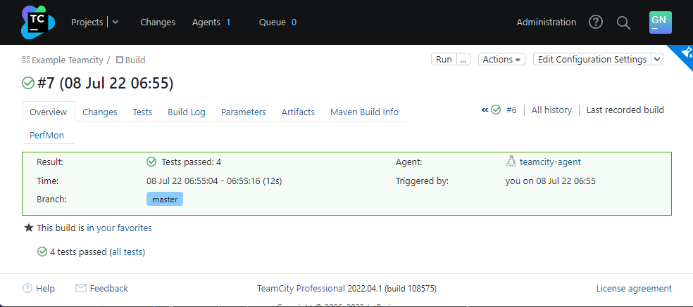
</p>

4. Поменяйте условия сборки: если сборка по ветке `master`, то должен происходит `mvn clean deploy`, иначе `mvn clean test`  
Ответ:  
<p align="left">
  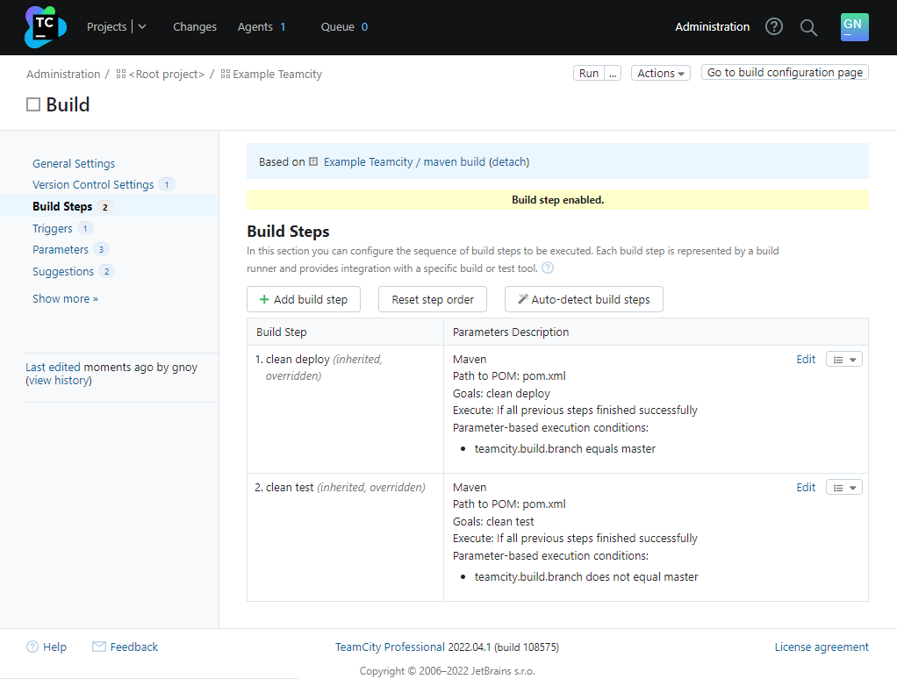
</p>

5. Для deploy будет необходимо загрузить [settings.xml](./src/teamcity/settings.xml) в набор конфигураций maven у teamcity, предварительно записав туда креды для подключения к nexus  
Ответ:  
<p align="left">
  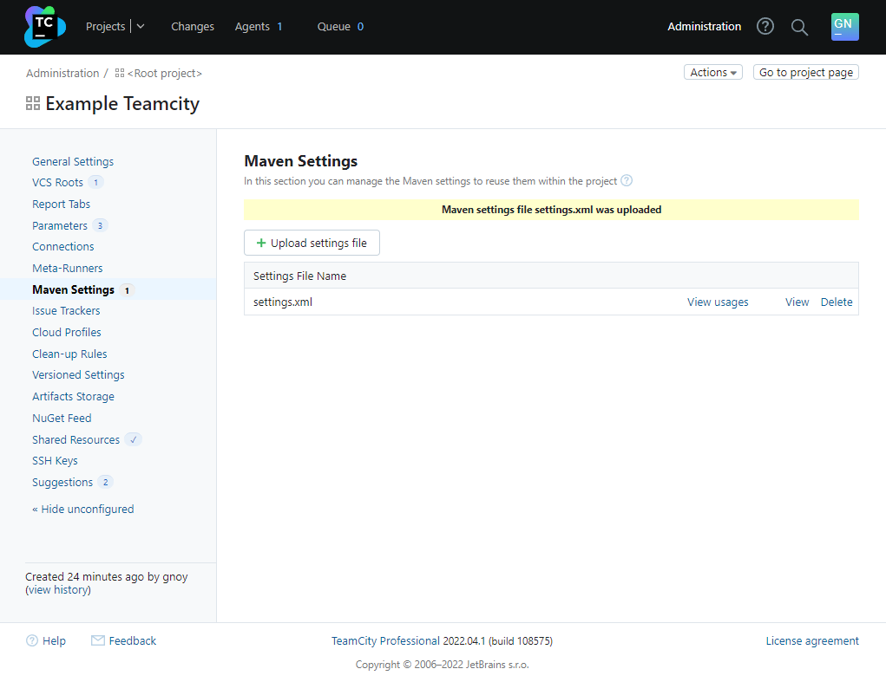
</p>

6. В pom.xml необходимо поменять ссылки на репозиторий и nexus  
Ответ:  
<p align="left">
  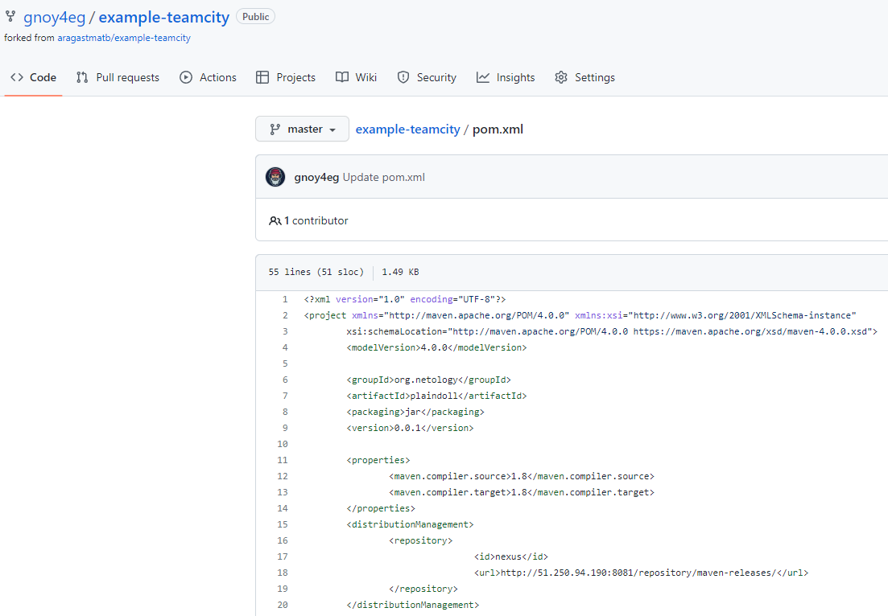
</p>

7. Запустите сборку по master, убедитесь что всё прошло успешно, артефакт появился в nexus  
Ответ:  
<p align="left">
  
</p>

8. Мигрируйте `build configuration` в репозиторий  
Ответ:  
<p align="left">
  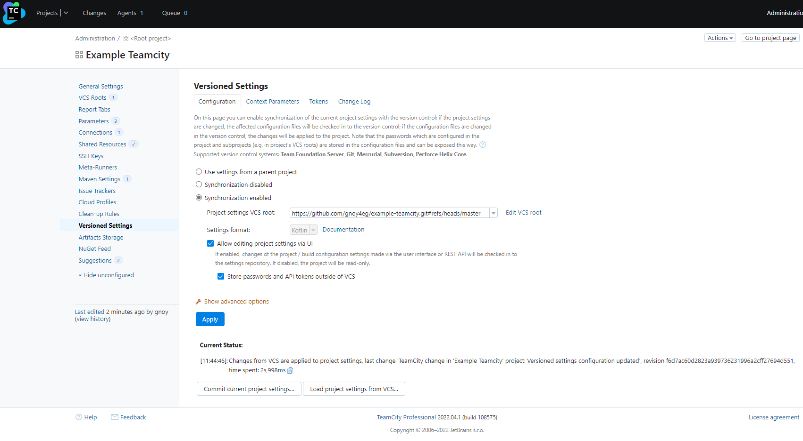
</p>

9. Создайте отдельную ветку `feature/add_reply` в репозитории  
Ответ:  
<p align="left">
  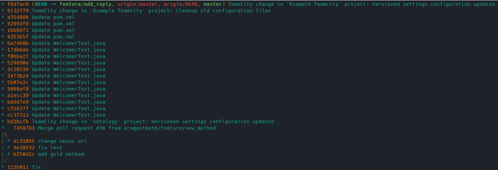
</p>

10. Напишите новый метод для класса Welcomer: метод должен возвращать произвольную реплику, содержащую слово `hunter`  
Ответ:  
```java
...
	public String sayHunter(){
		return "New method for class Welcomer - hunter";
	}
```
11. Дополните тест для нового метода на поиск слова `hunter` в новой реплике  
Ответ:  
```java
...
	@Test
	public void welcomerSaysHunter() {
		assertThat(welcomer.sayWelcome(), containsString("hunter"));
		assertThat(welcomer.sayFarewell(), containsString("hunter"));
		assertThat(welcomer.sayHunter(), containsString("hunter"));
	}
...
```

12. Сделайте push всех изменений в новую ветку в репозиторий  
Ответ:  
<p align="left">
  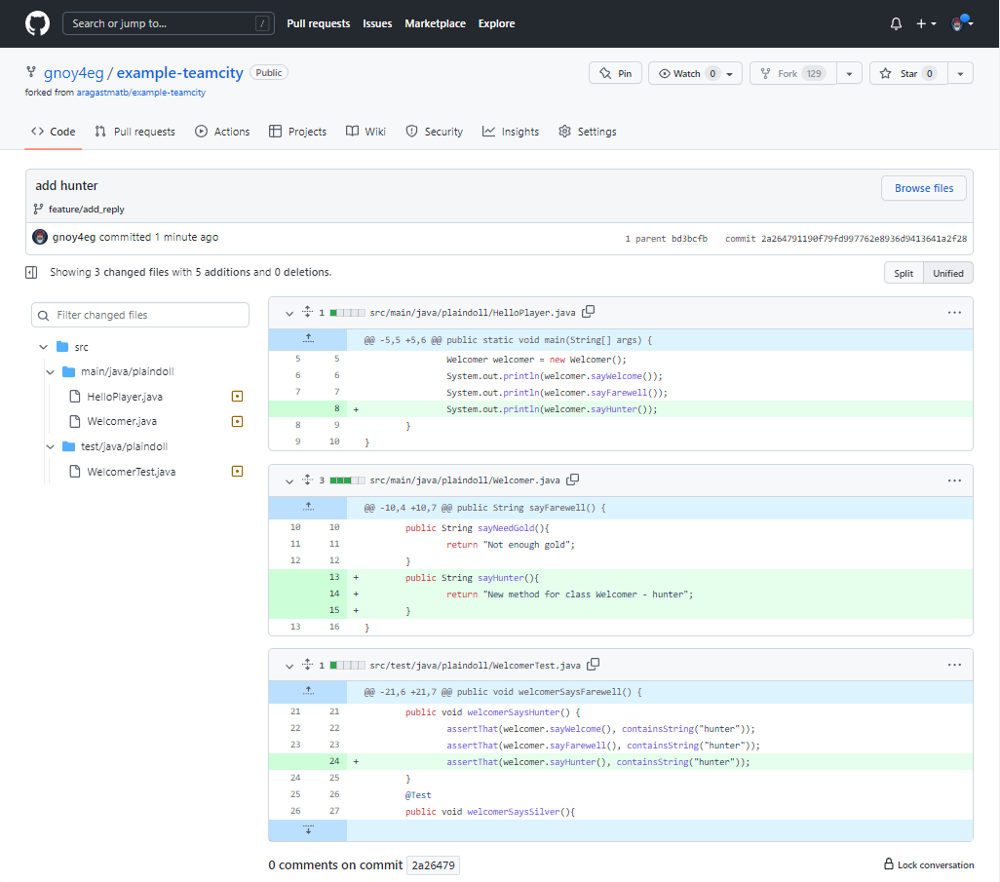
</p>

13. Убедитесь что сборка самостоятельно запустилась, тесты прошли успешно  
Ответ:  
<p align="left">
  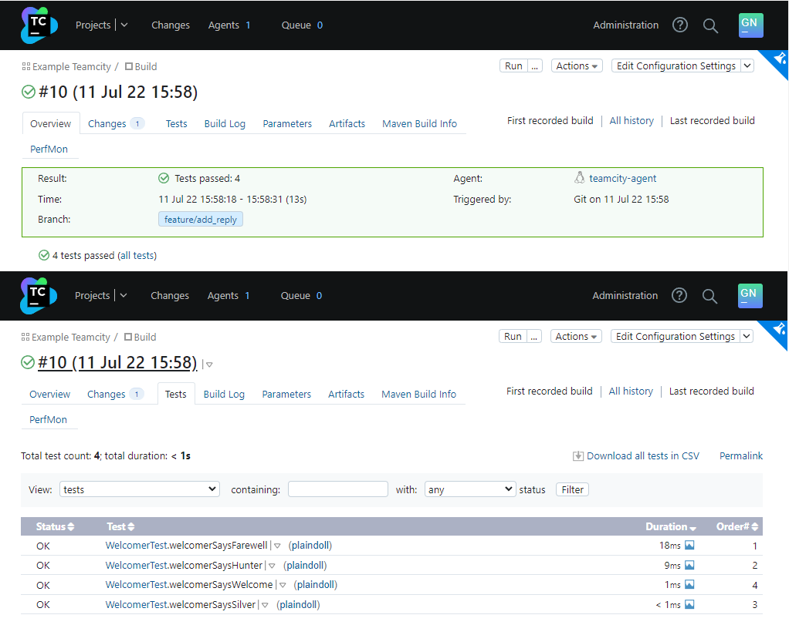
</p>

14. Внесите изменения из произвольной ветки `feature/add_reply` в `master` через `Merge`  
Ответ:  
<p align="left">
  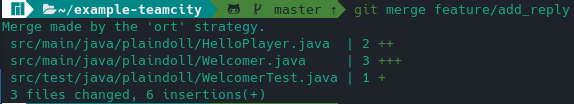
</p>

15. Убедитесь, что нет собранного артефакта в сборке по ветке `master`  
Ответ:  
<p align="left">
  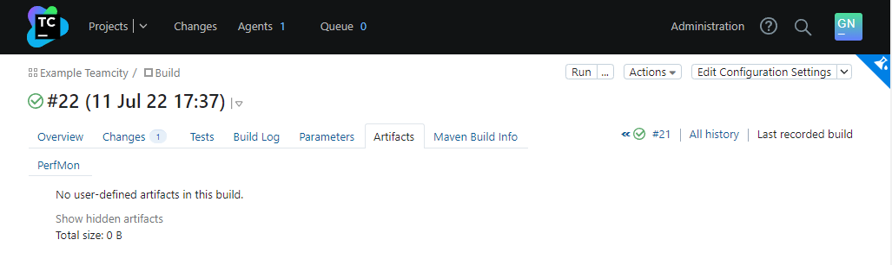
</p>

16. Настройте конфигурацию так, чтобы она собирала `.jar` в артефакты сборки  
Ответ:  
<p align="left">
  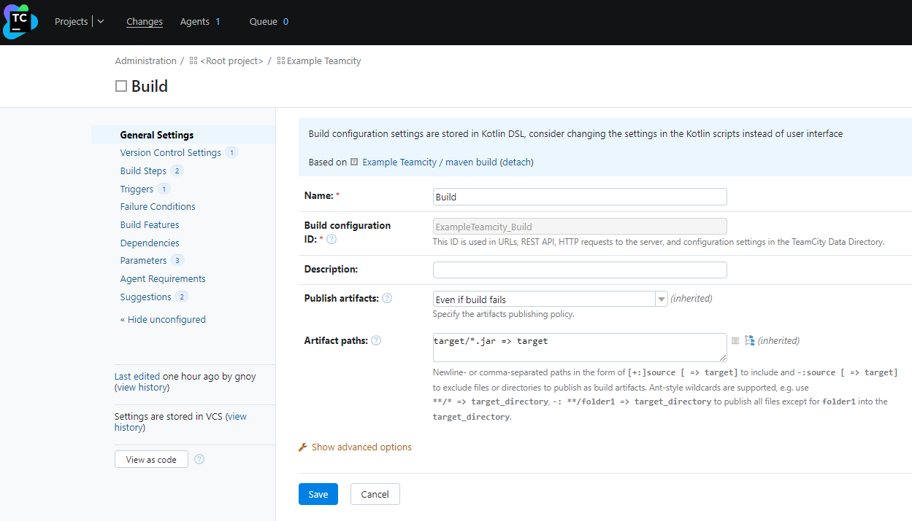
</p>

17. Проведите повторную сборку мастера, убедитесь, что сбора прошла успешно и артефакты собраны  
Ответ:  
<p align="left">
  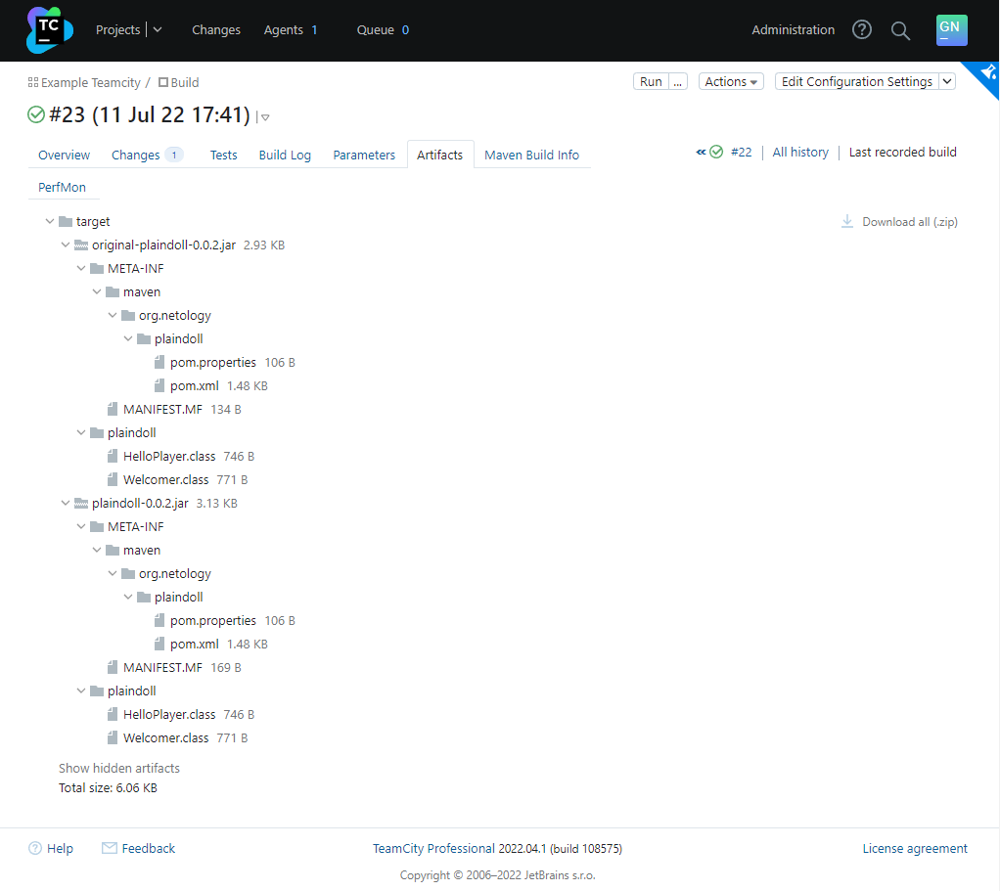
</p>
<p align="left">
  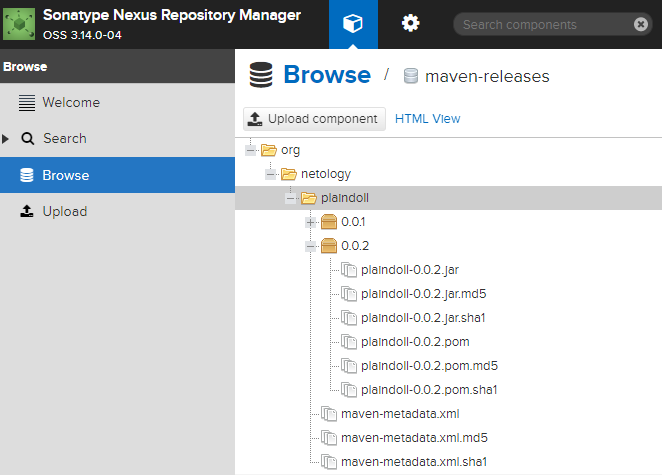
</p>

18. Проверьте, что конфигурация в репозитории содержит все настройки конфигурации из teamcity  
Ответ:  
<p align="left">
  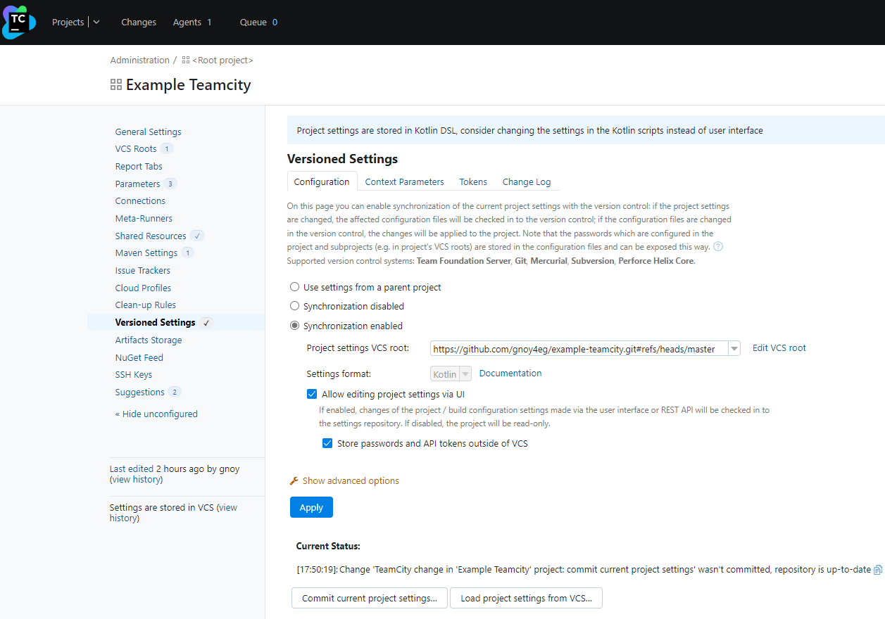
</p>

19. В ответ предоставьте ссылку на репозиторий  
Ответ:  
[Example Teamcity](https://github.com/gnoy4eg/example-teamcity)
