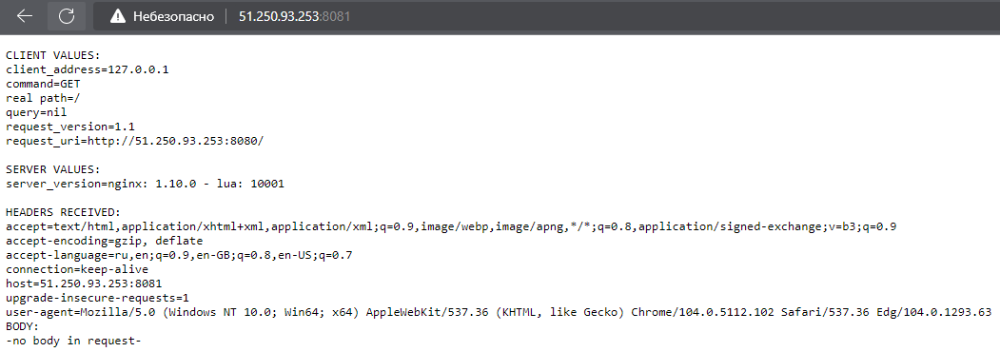

# Домашнее задание к занятию "12.1 Компоненты Kubernetes"

Вы DevOps инженер в крупной компании с большим парком сервисов. Ваша задача — разворачивать эти продукты в корпоративном кластере. 

## Задача 1: Установить Minikube

Для экспериментов и валидации ваших решений вам нужно подготовить тестовую среду для работы с Kubernetes. Оптимальное решение — развернуть на рабочей машине Minikube.

### Как поставить на AWS:
- создать EC2 виртуальную машину (Ubuntu Server 20.04 LTS (HVM), SSD Volume Type) с типом **t3.small**. Для работы потребуется настроить Security Group для доступа по ssh. Не забудьте указать keypair, он потребуется для подключения.
- подключитесь к серверу по ssh (ssh ubuntu@<ipv4_public_ip> -i <keypair>.pem)
- установите миникуб и докер следующими командами:
  - curl -LO https://storage.googleapis.com/kubernetes-release/release/`curl -s https://storage.googleapis.com/kubernetes-release/release/stable.txt`/bin/linux/amd64/kubectl
  - chmod +x ./kubectl
  - sudo mv ./kubectl /usr/local/bin/kubectl
  - sudo apt-get update && sudo apt-get install docker.io conntrack -y
  - curl -Lo minikube https://storage.googleapis.com/minikube/releases/latest/minikube-linux-amd64 && chmod +x minikube && sudo mv minikube /usr/local/bin/
- проверить версию можно командой minikube version
- переключаемся на root и запускаем миникуб: minikube start --vm-driver=none
- после запуска стоит проверить статус: minikube status
- запущенные служебные компоненты можно увидеть командой: kubectl get pods --namespace=kube-system

### Для сброса кластера стоит удалить кластер и создать заново:
- minikube delete
- minikube start --vm-driver=none

Возможно, для повторного запуска потребуется выполнить команду: sudo sysctl fs.protected_regular=0

Инструкция по установке Minikube - [ссылка](https://kubernetes.io/ru/docs/tasks/tools/install-minikube/)

**Важно**: t3.small не входит во free tier, следите за бюджетом аккаунта и удаляйте виртуалку.  

**Ответ:**  
Я установил minikube на своей виртуальной машине
```bash
[gnoy@manjarokde-ws01 src]$ minikube status
minikube
type: Control Plane
host: Running
kubelet: Running
apiserver: Running
kubeconfig: Configured
[gnoy@manjarokde-ws01 ~]$ kubectl get nodes
NAME       STATUS   ROLES           AGE   VERSION
minikube   Ready    control-plane   10m   v1.24.3
```

## Задача 2: Запуск Hello World
После установки Minikube требуется его проверить. Для этого подойдет стандартное приложение hello world. А для доступа к нему потребуется ingress.

- развернуть через Minikube тестовое приложение по [туториалу](https://kubernetes.io/ru/docs/tutorials/hello-minikube/#%D1%81%D0%BE%D0%B7%D0%B4%D0%B0%D0%BD%D0%B8%D0%B5-%D0%BA%D0%BB%D0%B0%D1%81%D1%82%D0%B5%D1%80%D0%B0-minikube)
- установить аддоны ingress и dashboard

**Ответ:**  
```bash
[gnoy@manjarokde-ws01 src]$ kubectl create deployment hello-node --image=k8s.gcr.io/echoserver:1.4
deployment.apps/hello-node created
[gnoy@manjarokde-ws01 src]$ kubectl get pods
NAME                          READY   STATUS    RESTARTS   AGE
hello-node-6d5f754cc9-glpkd   1/1     Running   0          14s
```

## Задача 3: Установить kubectl

Подготовить рабочую машину для управления корпоративным кластером. Установить клиентское приложение kubectl.
- подключиться к minikube 
- проверить работу приложения из задания 2, запустив port-forward до кластера

**Ответ:**  
```bash
[gnoy@manjarokde-ws01 src]$ kubectl version --client
WARNING: This version information is deprecated and will be replaced with the output from kubectl version --short.  Use --output=yaml|json to get the full version.
Client Version: version.Info{Major:"1", Minor:"24", GitVersion:"v1.24.4", GitCommit:"95ee5ab382d64cfe6c28967f36b53970b8374491", GitTreeState:"clean", BuildDate:"2022-08-17T18:54:23Z", GoVersion:"go1.18.5", Compiler:"gc", Platform:"linux/amd64"}
Kustomize Version: v4.5.4
```
Разверну Minikube в YC и попробую к нему подключиться с клиентской машины. Minikube запущу с дополнительными ключами.
```bash
[gnoy@node-01 ~]$ sudo yum install -y conntrack
[gnoy@node-01 ~]$ cd /usr/bin/
[gnoy@node-01 bin]$ sudo ln -s /usr/sbin/conntrack conntrack
[gnoy@node-01 bin]$ minikube start --apiserver-ips=51.250.93.253 --vm-driver=none --kubernetes-version=v1.23.8
😄  minikube v1.26.1 on Centos 7.9.2009 (amd64)
✨  Using the none driver based on user configuration
👍  Starting control plane node minikube in cluster minikube
🤹  Running on localhost (CPUs=2, Memory=3789MB, Disk=10227MB) ...
ℹ️  OS release is CentOS Linux 7 (Core)
    > kubectl.sha256:  64 B / 64 B [-------------------------] 100.00% ? p/s 0s
    > kubeadm.sha256:  64 B / 64 B [-------------------------] 100.00% ? p/s 0s
    > kubelet.sha256:  64 B / 64 B [-------------------------] 100.00% ? p/s 0s
    > kubeadm:  43.12 MiB / 43.12 MiB [----------] 100.00% 179.15 MiB p/s 400ms
    > kubectl:  44.44 MiB / 44.44 MiB [-----------] 100.00% 61.78 MiB p/s 900ms
    > kubelet:  118.78 MiB / 118.78 MiB [---------] 100.00% 133.78 MiB p/s 1.1s

    ▪ Generating certificates and keys ...
    ▪ Booting up control plane ...
    ▪ Configuring RBAC rules ...
🤹  Configuring local host environment ...

❗  The 'none' driver is designed for experts who need to integrate with an existing VM
💡  Most users should use the newer 'docker' driver instead, which does not require root!
📘  For more information, see: https://minikube.sigs.k8s.io/docs/reference/drivers/none/

❗  kubectl and minikube configuration will be stored in /home/gnoy
❗  To use kubectl or minikube commands as your own user, you may need to relocate them. For example, to overwrite your own settings, run:

    ▪ sudo mv /home/gnoy/.kube /home/gnoy/.minikube $HOME
    ▪ sudo chown -R $USER $HOME/.kube $HOME/.minikube

💡  This can also be done automatically by setting the env var CHANGE_MINIKUBE_NONE_USER=true
🔎  Verifying Kubernetes components...
    ▪ Using image gcr.io/k8s-minikube/storage-provisioner:v5
🌟  Enabled addons: default-storageclass, storage-provisioner

❗  /usr/local/bin/kubectl is version 1.25.0, which may have incompatibilites with Kubernetes 1.23.8.
    ▪ Want kubectl v1.23.8? Try 'minikube kubectl -- get pods -A'
🏄  Done! kubectl is now configured to use "minikube" cluster and "default" namespace by default
```
Для доступа с локального ПК до minikube в YC, необходимо скопировать сертификаты и файл конфигурации на локальный ПК.
```bash
[gnoy@node-01 ~]$ cp .kube/config transfer/
[gnoy@node-01 ~]$ cp .minikube/profiles/minikube/client.crt transfer/
[gnoy@node-01 ~]$ cp .minikube/profiles/minikube/client.key transfer/
[gnoy@node-01 ~]$ cp .minikube/ca.crt transfer/
[gnoy@node-01 ~]$ chmod +r transfer/client.key 
[gnoy@node-01 ~]$ chmod +r transfer/config 
[gnoy@manjarokde-ws01 ~]$ scp -r gnoy@51.250.93.253:/home/gnoy/transfer/ .
```
На локальной системе "расскидываю" файлы:
```bash
[gnoy@manjarokde-ws01 ~]$ mkdir .kube/minikubeyc
[gnoy@manjarokde-ws01 ~]$ cp transfer/client.crt .kube/minikubeyc/
[gnoy@manjarokde-ws01 ~]$ cp transfer/client.key .kube/minikubeyc/
[gnoy@manjarokde-ws01 ~]$ cp transfer/ca.crt .kube/minikubeyc/  
[gnoy@manjarokde-ws01 ~]$ cp transfer/config .kube/
```
Правлю конфигурационный файл `~/.kube/config` до состояния:
```yml
apiVersion: v1
clusters:
- cluster:
    certificate-authority: /home/gnoy/.kube/minikubeyc/ca.crt
    extensions:
    - extension:
        last-update: Thu, 25 Aug 2022 13:53:45 UTC
        provider: minikube.sigs.k8s.io
        version: v1.26.1
      name: cluster_info
    server: https://51.250.93.253:8443
  name: minikube
contexts:
- context:
    cluster: minikube
    extensions:
    - extension:
        last-update: Thu, 25 Aug 2022 13:53:45 UTC
        provider: minikube.sigs.k8s.io
        version: v1.26.1
      name: context_info
    namespace: default
    user: minikube
  name: minikube
current-context: minikube
kind: Config
preferences: {}
users:
- name: minikube
  user:
    client-certificate: /home/gnoy/.kube/minikubeyc/client.crt
    client-key: /home/gnoy/.kube/minikubeyc/client.key
```
Проверяю доступность кластера:
```bash
[gnoy@manjarokde-ws01 ~]$ kubectl cluster-info
Kubernetes control plane is running at https://51.250.93.253:8443
CoreDNS is running at https://51.250.93.253:8443/api/v1/namespaces/kube-system/services/kube-dns:dns/proxy
To further debug and diagnose cluster problems, use 'kubectl cluster-info dump'.
[gnoy@manjarokde-ws01 ~]$ kubectl get nodes
NAME                           STATUS   ROLES                  AGE   VERSION
node-01.ru-central1.internal   Ready    control-plane,master   25m   v1.23.8
```
Продолжаю настройку:
```bash
[gnoy@node-01 ~]$ minikube addons enable ingress
💡  ingress is an addon maintained by Kubernetes. For any concerns contact minikube on GitHub.
You can view the list of minikube maintainers at: https://github.com/kubernetes/minikube/blob/master/OWNERS
    ▪ Using image k8s.gcr.io/ingress-nginx/controller:v1.2.1
    ▪ Using image k8s.gcr.io/ingress-nginx/kube-webhook-certgen:v1.1.1
    ▪ Using image k8s.gcr.io/ingress-nginx/kube-webhook-certgen:v1.1.1
🔎  Verifying ingress addon...
🌟  The 'ingress' addon is enabled
[gnoy@node-01 ~]$ minikube addons enable dashboard
💡  dashboard is an addon maintained by Kubernetes. For any concerns contact minikube on GitHub.
You can view the list of minikube maintainers at: https://github.com/kubernetes/minikube/blob/master/OWNERS
    ▪ Using image kubernetesui/dashboard:v2.6.0
    ▪ Using image kubernetesui/metrics-scraper:v1.0.8
💡  Some dashboard features require the metrics-server addon. To enable all features please run:
        minikube addons enable metrics-server
🌟  The 'dashboard' addon is enabled
[gnoy@manjarokde-ws01 ~]$ kubectl create deployment hello-node --image=k8s.gcr.io/echoserver:1.4
deployment.apps/hello-node created
[gnoy@manjarokde-ws01 ~]$ kubectl expose deployment hello-node --type=NodePort --port=8080
service/hello-node exposed
[gnoy@node-01 ~]$ kubectl port-forward --address 0.0.0.0 service/hello-node 8081:8080
Forwarding from 0.0.0.0:8081 -> 8080
Handling connection for 8081
```
Проверяю:
<p align="left">
  
</p>

Ура! Доступ к приложению есть!

## Задача 4 (*): собрать через ansible (необязательное)

Профессионалы не делают одну и ту же задачу два раза. Давайте закрепим полученные навыки, автоматизировав выполнение заданий  ansible-скриптами. При выполнении задания обратите внимание на доступные модули для k8s под ansible.
 - собрать роль для установки minikube на aws сервисе (с установкой ingress)
 - собрать роль для запуска в кластере hello world
