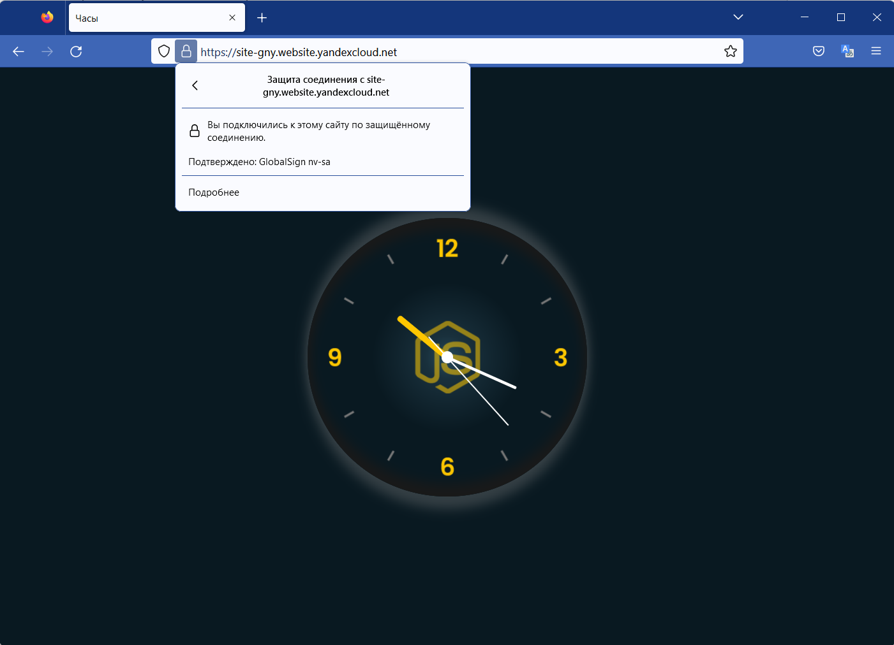

# Домашнее задание к занятию 15.3 "Безопасность в облачных провайдерах"
Используя конфигурации, выполненные в рамках предыдущих домашних заданиях, нужно добавить возможность шифрования бакета.

---
## Задание 1. Яндекс.Облако (обязательное к выполнению)
1. С помощью ключа в KMS необходимо зашифровать содержимое бакета:
- Создать ключ в KMS,
- С помощью ключа зашифровать содержимое бакета, созданного ранее.
2. (Выполняется НЕ в terraform) *Создать статический сайт в Object Storage c собственным публичным адресом и сделать доступным по HTTPS
- Создать сертификат,
- Создать статическую страницу в Object Storage и применить сертификат HTTPS,
- В качестве результата предоставить скриншот на страницу с сертификатом в заголовке ("замочек").

Документация
- [Настройка HTTPS статичного сайта](https://cloud.yandex.ru/docs/storage/operations/hosting/certificate)
- [Object storage bucket](https://registry.terraform.io/providers/yandex-cloud/yandex/latest/docs/resources/storage_bucket)
- [KMS key](https://registry.terraform.io/providers/yandex-cloud/yandex/latest/docs/resources/kms_symmetric_key)


**Ответ:**  
Это задание связано только с работой бакета, нет необходимости разворачивать ВМки. По этой причине, я удалил конфигурационные файлы tf'а для разворачивания не нужных в данный момент инстансов.  
Конфигурация terraform'а [ТУТ](./src/)  
Применяю конфигурацию `terraform apply --auto-approve` и проверяю доступ к файлу в созданном бакете:
```bash
❯ curl https://storage.yandexcloud.net/gny-201222/avatar
<?xml version="1.0" encoding="UTF-8"?>
<Error><Code>AccessDenied</Code><Message>Access Denied</Message><Resource>/gny-201222/avatar</Resource><RequestId>d4b06e166e8af68c</RequestId></Error>%
```
Как видно, доступ ограничен.   
Дополнительно [СКРИНШОТ](./img/access_denied.png) из браузера


---

Дополнительно "создал сайт", подробнее на скриншотах ниже:
<p align="left">
  
</p> 
<p align="left">
  
</p> 
