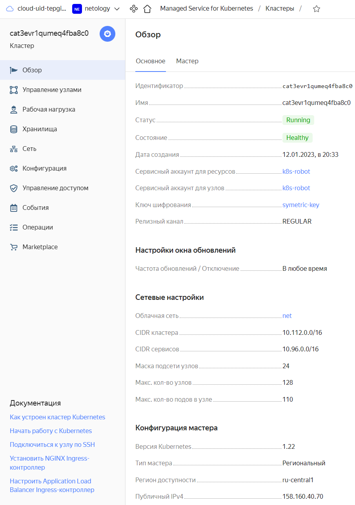

# Домашнее задание к занятию 15.4 "Кластеры. Ресурсы под управлением облачных провайдеров"

Организация кластера Kubernetes и кластера баз данных MySQL в отказоустойчивой архитектуре.
Размещение в private подсетях кластера БД, а в public - кластера Kubernetes.

---
## Задание 1. Яндекс.Облако (обязательное к выполнению)

1. Настроить с помощью Terraform кластер баз данных MySQL:
- Используя настройки VPC с предыдущих ДЗ, добавить дополнительно подсеть private в разных зонах, чтобы обеспечить отказоустойчивость 
- Разместить ноды кластера MySQL в разных подсетях
- Необходимо предусмотреть репликацию с произвольным временем технического обслуживания
- Использовать окружение PRESTABLE, платформу Intel Broadwell с производительностью 50% CPU и размером диска 20 Гб
- Задать время начала резервного копирования - 23:59
- Включить защиту кластера от непреднамеренного удаления
- Создать БД с именем `netology_db` c логином и паролем

2. Настроить с помощью Terraform кластер Kubernetes
- Используя настройки VPC с предыдущих ДЗ, добавить дополнительно 2 подсети public в разных зонах, чтобы обеспечить отказоустойчивость
- Создать отдельный сервис-аккаунт с необходимыми правами 
- Создать региональный мастер kubernetes с размещением нод в разных 3 подсетях
- Добавить возможность шифрования ключом из KMS, созданного в предыдущем ДЗ
- Создать группу узлов состояющую из 3 машин с автомасштабированием до 6
- Подключиться к кластеру с помощью `kubectl`
- *Запустить микросервис phpmyadmin и подключиться к БД, созданной ранее
- *Создать сервис типы Load Balancer и подключиться к phpmyadmin. Предоставить скриншот с публичным адресом и подключением к БД

Документация
- [MySQL cluster](https://registry.terraform.io/providers/yandex-cloud/yandex/latest/docs/resources/mdb_mysql_cluster)
- [Создание кластера kubernetes](https://cloud.yandex.ru/docs/managed-kubernetes/operations/kubernetes-cluster/kubernetes-cluster-create)
- [K8S Cluster](https://registry.terraform.io/providers/yandex-cloud/yandex/latest/docs/resources/kubernetes_cluster)
- [K8S node group](https://registry.terraform.io/providers/yandex-cloud/yandex/latest/docs/resources/kubernetes_node_group)


**Ответ:**  
Конфигурация tarraform находится [ТУТ](./src/)  
Проверяю созданный кластер MySQL:
<p align="left">
  
</p> 
Рабочие хосты:
<p align="left">
  
</p> 
Пользователи:
<p align="left">
  
</p> 
БД:
<p align="left">
  
</p> 
Резервные копии:
<p align="left">
  
</p> 
Топологию:
<p align="left">
  
</p> 


---

Конфигурация tarraform находится [ТУТ](./src/)  
Проверяю созданный кластер Kubernetes:
<p align="left">
  
</p> 

Проверяю сервисные аккаунты:
<p align="left">
  
</p> 

Проверяю настройки кластера:
<p align="left">
  
</p> 

Проверяю worker'ы:
<p align="left">
  
</p> 
<p align="left">
  
</p> 

KMS:
<p align="left">
  
</p> 

Проверяю группу узлов:
<p align="left">
  
</p> 

Добавляю кластер в контекст:
```
❯ yc managed-kubernetes cluster get-credentials --id cat3evr1qumeq4fba8c0 --external


Context 'yc-managed-k8s-cat3evr1qumeq4fba8c0' was added as default to kubeconfig '/home/schipyshev/.kube/config'.
Check connection to cluster using 'kubectl cluster-info --kubeconfig /home/schipyshev/.kube/config'.       

Note, that authentication depends on 'yc' and its config profile 'netology'.
To access clusters using the Kubernetes API, please use Kubernetes Service Account.
```
Проверяю поды в кластере:
```bash
❯ kubectl get pods -A

NAMESPACE     NAME                                   READY   STATUS    RESTARTS   AGE
kube-system   coredns-5f8dbbff8f-c5vms               1/1     Running   0          17m
kube-system   coredns-5f8dbbff8f-x7gd6               1/1     Running   0          14m
kube-system   ip-masq-agent-fxh48                    1/1     Running   0          14m
kube-system   ip-masq-agent-mt44z                    1/1     Running   0          14m
kube-system   ip-masq-agent-xhvx5                    1/1     Running   0          14m
kube-system   kube-dns-autoscaler-598db8ff9c-vj7k9   1/1     Running   0          17m
kube-system   kube-proxy-4jcp9                       1/1     Running   0          14m
kube-system   kube-proxy-4tfhz                       1/1     Running   0          14m
kube-system   kube-proxy-hpdrv                       1/1     Running   0          14m
kube-system   metrics-server-7574f55985-wlxgx        2/2     Running   0          14m
kube-system   npd-v0.8.0-4thtr                       1/1     Running   0          14m
kube-system   npd-v0.8.0-b9nwp                       1/1     Running   0          14m
kube-system   npd-v0.8.0-l2z2t                       1/1     Running   0          14m
kube-system   yc-disk-csi-node-v2-q2bk9              6/6     Running   0          14m
kube-system   yc-disk-csi-node-v2-sqs9m              6/6     Running   0          14m
kube-system   yc-disk-csi-node-v2-zm9wn              6/6     Running   0          14m
```
Закончили упражнение.  
Схлопываю инфру `terraform destroy --auto-approve`
